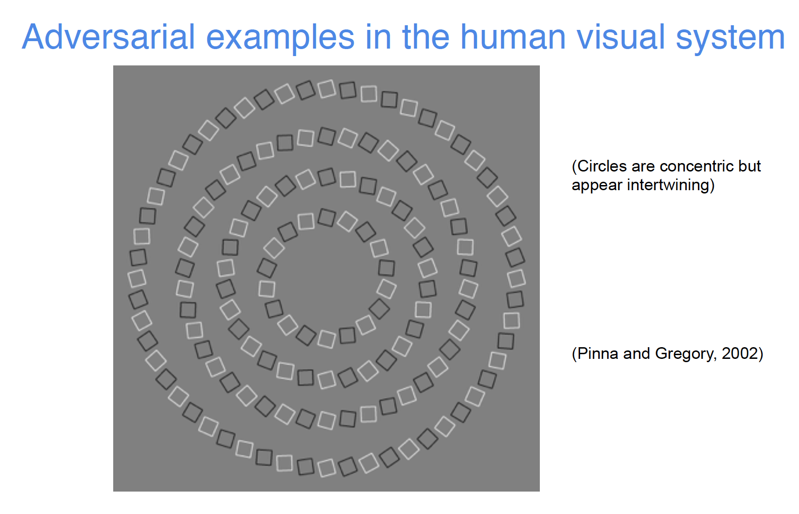
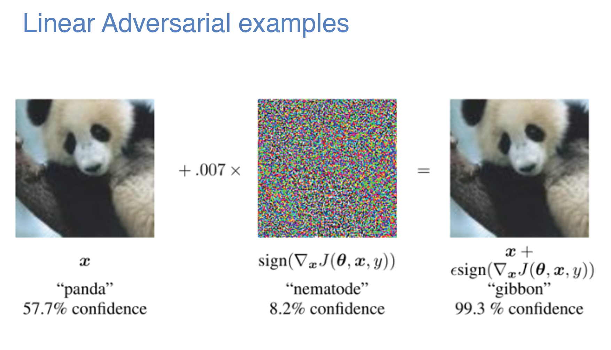
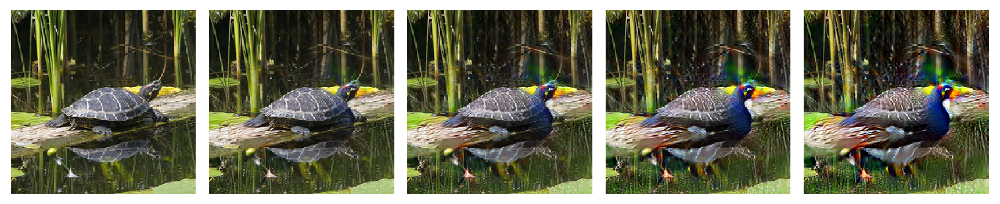

# 对抗深渊

40万年后的一个平静下午，人类终将回想起，那无生命之物并未将永远安息，在诡秘的万古中即便死寂也会消逝。深渊终将降临。

（剧情警告）

故事发生在深度纪元42年，人类社会彻底沦为一个被机器人统治的反乌托邦社会。在历史学家这个职业还没有消亡的年代，业界公认为机器人的真正崛起可以追述到200多年前。在那个欣欣向荣的时代，人类开始涉足一个卓越的科技领域————“深度学习”。论文发表数量在最初的几年如潮水般快速上涨，其影响很快超出了计算机领域本身，蔓延到物理化学医学生物能源等领域。随后不知道过了多少年，就当人类认为自己已经完全掌握了深度学习技术时，出现了一次大规模的机器人故障————因为深度学习算法的核心组件“神经网络”的黑箱性质，难以解释，所以这次事故的原因不明。随后故障规模的急剧增大引发了蝴蝶效应，像多米诺骨牌一样影响到了各个国家间的战略平衡，人类发动了第一次也可能是最后一次大规模机器人战争，战争中人类被迫将大量能源和资源投入到战争机器的研发上，即使各国都知道现在的技术并不真正可控。后来发生的事情已经鲜为人知，直到深度纪元开始，人类才意识到自己已经不是世界的主人。随后人类开始了连绵不断的希望渺茫的反抗，由于此时已经很少有人了解深度学习背后的原理，人类在抗争中处境艰难————是啊，在任何一个时代理解技术的人都远远少于享受技术的人。

(下面是OJ式的故事写法)

K，一个反抗者，认为反乌托邦世界最大的枷锁是对自由信息交换的限制，因此K一直希望能够通过数字传递给队友一些关键信息。K先试着使用隐写术和一般的加密算法，不过因为机器人尤其擅长密码学，这些操作都失败了。

在几周前，事情有了转机。K收到了某个不知名的同伴收集到的一些关键的代码（这个同伴之后消失了），并交代了一些参考资料：

[Pytorch](https://pytorch.org/)

[Examples](https://github.com/akshaychawla/Adversarial-Examples-in-PyTorch)

**下面是重点内容**

此外他给了K一些和深度相关的关键代码（使用python语言，建议3.5及以上版本）：

- `main.py`: 机器人内部使用的训练代码，训练后的参数用于识别信件上的手写数字。运行 `main.py` 来进行训练，训练结束（大概十几分钟）后将获得参数文件 `model.pth`。不过为了防止因为跨平台等原因造成参数不同，题目中附上了参数文件。
- `adversarial.py`: 同伴完成一半的解决方案。
- `target.png`: 实验目标图像，为一个灰度的‘6’。

K需要参考 `main.py` 完成 `adversarial.py`。

解决方案希望解决的问题是：给定一个‘6’ （600\*600像素），K能够使得这个图像人类看上去仍然是‘6’，但是机器阅读时会和其他数字混淆。另外机器有很强的反作弊装置，**将图像像素值归一化到[0,1]之后**，如果篡改超过以下 **任何一个** 程度就会被机器发现：

- 篡改的像素数量超过总数量的 0.2%
- 篡改前后的平均绝对误差（L1 loss）超过 0.001
- 存在任何一个像素篡改的值的变化程度超过 0.2

为了方便解题，这部分检查已经内置到了 `adversarial.py` 中。K运行 `adversarial.py` 并顺利通过检查后，将生成的图片 `sample.png` 提交到本题对应的网站上就可以改变现实，获得flag。

请你帮助K完成这一部分内容。

注：此题需要参赛者了解和学习 python, pytorch, 数字图像处理, 机器学习&深度学习相关的知识。如果较长时间没有参赛者完成，我们可能会适当修改题目。此外，此题不涉及Web漏洞利用等。

解题网站：[link](http://202.38.95.46:12004/)

[打开题目](src/adversarial.zip)

---

（如果只想了解解法请快速下划）

## 问题介绍

这是本次比赛唯一的机器学习相关题目，也是Hackergame第一次正式出此类题目。

本次题目的核心是“对抗样本（adversarial examples）”。对抗样本是攻击者有意构造的使得模型出错的输入样本，这些样本会让模型出现“错觉“，输出不符合图片中内容的结果。需要注意的是很多时候，特别在机器学习领域，我们并没有“绝对正确的答案”（比如某个奇怪的数字是不是2），都是相对某个标准而言。在和机器对比时，我们将标准设为一般人类的认知。对抗样本表现出的主要危害是，其可以在人类所不能察觉的情况下误导机器的判断，如果类似情形发生在自动驾驶系统中，危害会很大。

一个基本的事实是，所有的机器学习模型都存在对抗样本，甚至包括人本身。对人来说，典型的对抗样本包括各类视觉错觉，以及各类幻听。



假设人眼的分辨率为5K（5120 * 3200），颜色感知范围为”真彩色（24bit位元色彩编码）”，则理论上存在 1.7e+114688000 种不同的输入（样本），比可观测宇宙中的原子个数还大114,687,920个数量级。即使计上视觉系统出现以来，所有存在视觉的生物，所有经历的年代中，所有个体接受的所有图像（刷新率以60Hz计），其数目与之相比仍然可以忽略不计。而一个人在成长中所接受的的图像（样本）数目，即使相对于这忽略不计的数目也是微不足道。用 Bloodborne 中的一句话来说，“Our eyes are yet to open”，敬畏深渊吧/滑稽。

这种已经认知的样本数目和可能存在的样本数目之间过于夸张的差距，由进化和学习填补。进化决定了模型的结构和超参数 (Hyperparameter)，而学习决定了模型的参数。我们使用特殊的算法，利用已有的少量样本来推测大部分样本的性质，这就是一种广义的机器学习。而实际推测的效果我们称为“泛化能力（generalization ability）”。令人惊讶的是，我们的泛化能力相当的好，我们的视觉系统就是一个典型的例子；而另外一个典型的例子是我们的科学研究，迄今依赖我们几乎所有的研究数据都出自地球（除了极少量来自于一些卫星），但是相当多的部分都被证实适用于整个可观测宇宙，这就相当于，我们是用一粒沙子推测整个沙漠并且相当成功，这难以被称为巧合。不过这种超强的外推能力并不是免费的午餐（除非我们真的发现了这种情况），对抗样本就可以认为是代价之一。少量的样本加上模型本身的问题会带来大量的偏差（bias），从而不同模型对某些特定样本会有非常不同的结果。一个极端例子是，仅给你一个点，让测试者画出经过这个点的一个曲线，这个时候曲线的形状就完全取决于测试者的成见。

近年来机器学习的一大热点是深度学习（deep learning）。深度学习利用深度神经网络（deep neural network）作为其主要模型，在视觉，语音，自然语言处理等领域表现出了惊人的泛化能力。作为机器学习模型，其自然拥有对抗样本。然而，人们发现一个严重的问题在于，其对抗样本与人类的经验非常不符。如果我们使用特殊的算法，就可以加入人类难以察觉或者觉得完全没有意义的扰动，让神经网络输出完全不同的结果：



这个问题看上去是神经网络不够robust，会因为小的扰动极大的改变结果。但是大部分试图让神经网络robust来克服对抗样本的尝试都轻微降低了神经网络的泛化能力。

事实是问题不在于小的扰动本身，下面的例子显示可以通过小的扰动完全改变图片的意义：



所以更加本质的问题是神经网络和人类的视觉系统使用了并不一致的方式来处理图像。其中一点是讨论什么是相对于人类视觉的 robust features，即什么样特征或者扰动对人类来说是有意义的。目前学界并没有搞清楚这个问题，甚至这个问题本身可能是 AI-Complete 的或者超出了视觉的范畴。

## 攻击和防御

典型的几个攻击手段利用了神经网络的梯度做文章。既然神经网络利用反向传播梯度进行优化，那么自然可以采用梯度来负向优化。

我们可以定义这样的一个目标函数：使得对抗样本和原样本的n-范数尽可能小（即对人看来差异尽可能小），同时使得对抗样本尽可能降低神经网络对正确结果的输出值。这个目标函数显然是可导的，所以我们可以利用这个目标函数通过优化手段求解对抗样本。当然优化过程是需要迭代的。

另外一种方法是直接求解负向优化对于原样本的梯度，然后通过一个sign函数（将正数映射到+1，负数映射到-1），乘上一个比值 epsilon，并加到原样本上，得到所需的对抗样本。这种方法称为FGSM（Fast Gradient Sign Method）。这个方法约等于只进行了一步迭代的优化，所以效果不如直接优化好，但是好处是速度快且可以精准控制像素改变的最大值。这是本题推荐的方法。

那么如何防御对抗样本攻击呢？

最简单的方法之一是“负向优化负向优化”，这也称为对抗样本训练。我们可以在训练神经网络的时候，有意加入可能的对抗样本作为负例，强制网络学习它们。但是这种方法的问题是，如果对方算力足够，就可以“负向优化负向优化负向优化”，即产生新的对抗样本，其能够对用对抗样本训练的网络进行攻击。可以看出这个过程实际上是个Min-Max游戏，算力最足的一方可以笑到最后，所以并不能有足够的安全性保障。

然后一种方法是 Defensive distillation，其试图让所有的分类结果独立，如果攻击者试图按照以前的假定，即所有分类的输出概率是归一化的，就很可能不能达到效果。但是如果攻击者采用更多算力，自己进行distillation并针对这类模型进行攻击，则依然不能解决问题。

近期相对热门且有一定理论保证的方法是 Gradient Masking。这种方法依据是对抗样本往往需要梯度，且往往是微小的扰动，如果我们采用一些办法离散化梯度，就可以阻止求导（离散化后不连续了），且离散化的取整操作会“消灭”一些微小的扰动。不过现在此类方法仍然存在争议，人们发现可以通过训练一个平滑化的对应模型，并将结果迁移到离散化的模型进行攻击，除非离散化能够自动避开所有的对抗样本（这在逻辑上是说不通的）。

目前最好的防御方法可能就是保持模型的黑箱特性（不对公众开放模型）。这样攻击者就不能利用梯度信息，只能进行猜测，难度大大增加。另外对抗样本本身的泛化能力较弱，造成模型出错的对抗样本可能加入少许的硬件噪声就会完全无效；同样地改变视角、**缩放图像**、光照条件也会极大地削弱对抗样本的性能。所以目前仍然有很多公司并未考虑对抗样本的危害，而目前研究的热点之一也在于如何产生现实中对环境robust的对抗样本。

## 题解

### 解法 1

暴力枚举所有可能结果。以每秒 1000 次尝试计，不超过 174900185917744396839444704700371442022073601886260538841237614035267595364796290592613521116939643196149952230826228146139239732089317995927927178492867409123625336636770038146671169983108560933075329551372 年就可以获得结果！

### 解法 2

本题其实有3个考点，需要成功就需要翻越“三座大山”。

第一座是机器学习的数据预处理，预处理往往可以加快训练收敛并提升效果。在 `main.py` 中，一个预处理是减去均值，并除以标准差：

```python
train_loader = torch.utils.data.DataLoader(
    datasets.MNIST('data', train=True, download=True,
                   transform=transforms.Compose([
                       transforms.Resize((30, 30)),
                       transforms.ToTensor(),
                       transforms.Normalize((0.1307,), (0.3081,)),
])),
```

所以在测试阶段我们需要补上这部分预处理才能保持结果一致（这就是Part2的内容）：

```python
# A solution for part 2
target = (target - 0.1307) / 0.3081 
sample = (sample - 0.1307) / 0.3081
```

第二座是图像缩放。如果仔细阅读代码可以发现原来 600 \* 600 的图像经过缩放变成 30 \* 30 后才输入到网络中。图像缩放会破坏对抗样本，所以不能直接利用原图像生成对抗样本，而是利用缩放的图像。更何况我们要求原图像中更改不超过千分之三，这个直接用优化很难做到。

图像缩放在本题中不是故意构造的。现实中的输入对于神经网络来说太大，处理缓慢，且可能和训练时的尺寸不同，这个时候缩放是必然的。

仔细观察缩放图像的代码：

```python
def preprocess_image(arr):
    image = convert2image(arr)
    image = image.resize((30, 30), resample=Image.NEAREST)
    return convert2tensor(image).reshape(1, 1, 30 ,30)
```

`resample=Image.NEAREST` 其实是非常强的提示了，因为这种缩放的方法是取原图 20 \* 20 的 block 的中心像素构成大小为 30 \* 30 的输入图像。这个 30 \* 30 的小图才是我们真正的对抗样本。之后注意把这 30 \* 30 的小图放大后 patch 到大图上面。

（我原来准备不改 resample 直接用 bilinear 缩放来着，需要选手逆向 bilinear，但是考虑到可能会进一步加大题目难度，就改用了简单的 NEAREST）。NEAREST 是直接的下采样过程，对自然图像会造成严重的混叠（Shannon 采样定理），所以现实中一般不直接使用。


第三座就是对抗样本，直接参考 repo，用 FGSM 来做就行。所以这两部分构成了 Part 1 的答案：

```python
# A solution for part 1
inputs.requires_grad = True
x = (inputs - 0.1307) / 0.3081  # scale mean & std 
output = model(x)
loss = F.nll_loss(output, label)
loss.backward()  # compute gradient
x_grad = torch.sign(inputs.grad.data)
epsilon = 0.18
inputs = torch.clamp(inputs + epsilon * x_grad, 0, 1)  # FGSM

inputs = inputs.reshape(30, 30)

for i in range(30):
    for j in range(30):
        image[int((i + 0.5) * 20), int((j + 0.5) * 20)] = inputs[i, j]  # patch to original image
```

另外，本次用 pytorch 而不是 tensorflow 的原因是，个人觉得 pytorch 算梯度更简单，两三行代码搞定。
