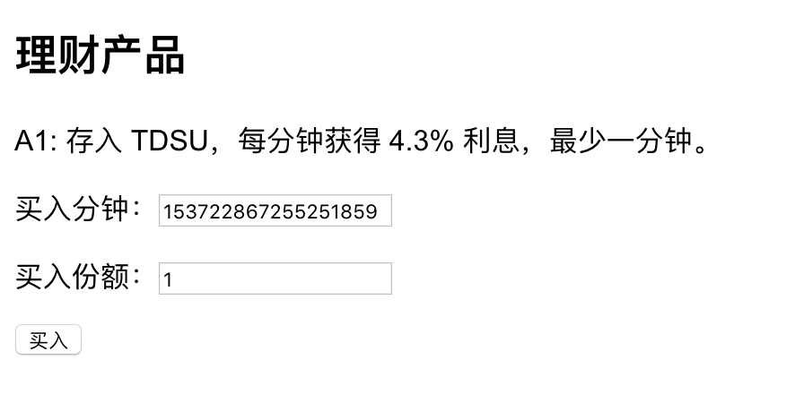
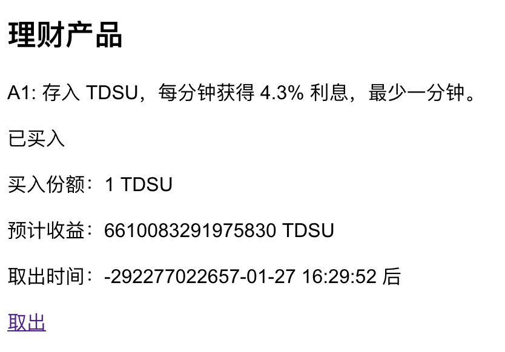
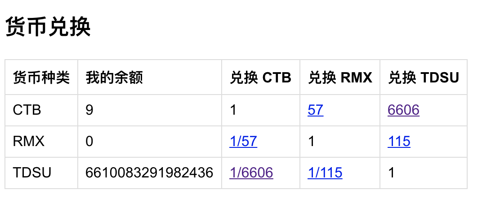

# 猫咪银行

欢迎来到猫咪系列题目之**猫咪银行**。

这道题是一道非常简单的题目，主要是想让同学们了解一些整数溢出的坑。

**本题的源代码和分析将很快发布，下面只是解题方法。**

## 解法

简单来说，只需要现兑换 TDSU，购买理财产品，购买时精心构造使得时间溢出为负或者是浮点数，而收益非常大即可。

一个 payload 是：

然后时间为负，直接取出即可：

最后换回 CTB，购买 flag，计划通！

flag: `flag{Evil_Integer._Evil_Overflow.}`

