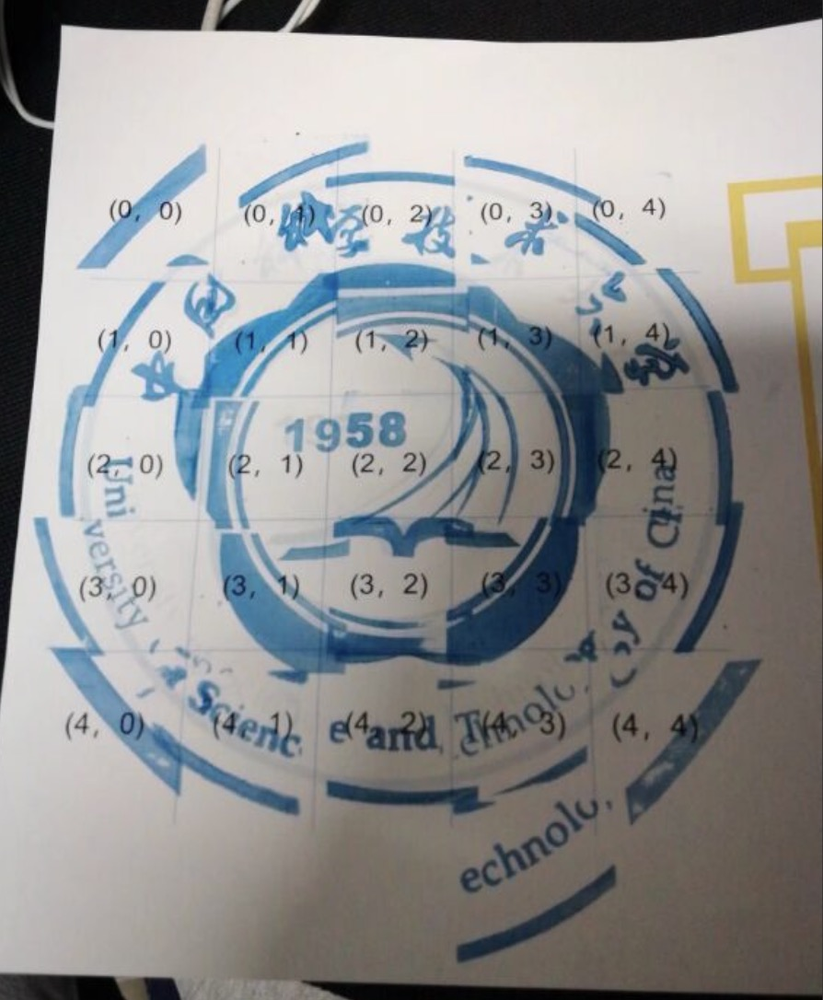

# 游园会的集章卡片

提示：flag 仅由 <code>0154agflPYHMGRCNE_{}</code> 这些字符组成。

我们经常被问一个问题：你们是从什么时候开始为 Hackergame 出题的？

其实我们全年都在出题，命题组成员来自各种各样的专业，在各种各样的地方，有各种各样不同的工作，闲暇之余~~（或者工作不饱和的时候，这个最好删掉）~~我们最大的乐趣就是互相出题给对方玩。

为了找到有趣的题目，我们需要源源不断的灵感，不管是在巴蜀人家二楼包厢 LUD（[注 1](https://lug.ustc.edu.cn/wiki/lug/events/start?s%5B%5D=lud)） 时，还是在北京食宝街的分米鸡，甚至是在武汉开往合肥的 D2256 列车上，我们会把讨论到的有趣的想法记录下来，作为下一次 Hackergame 的题目。

比如前几天，中国科学技术大学学生 Linux 用户协会在中区游园会摆摊招新（[注 2](https://lug.ustc.edu.cn/wiki/lug/contribute)），发现学校居然为每个参加游园会的同学准备了一张精美的集章卡片：

到每个社团的摊位上收集盖章，到达一定数量就有礼品赠送。

突然一位同学灵机一动，不如写上 flag 然后撕碎！

附件就是撕碎的 flag，相信对中国科学技术大学校徽了如指掌的你很快就能将它还原。

[打开题目](src/fragments.zip)

---

### 致歉：由于使用的字体不好，很多同学反映 flag 上的字母与数字难以辨认，在这里为给大家带来的不便表示歉意！

## 解答

### 解法1: 使用 photoshop、powerpoint 等软件将各块碎片拼起来即可见到 flag:  

### 解法2: 将碎片打印出来拼接到一起读出 flag

flag{H4PPY_1M4GE_PR0CE551NG}
