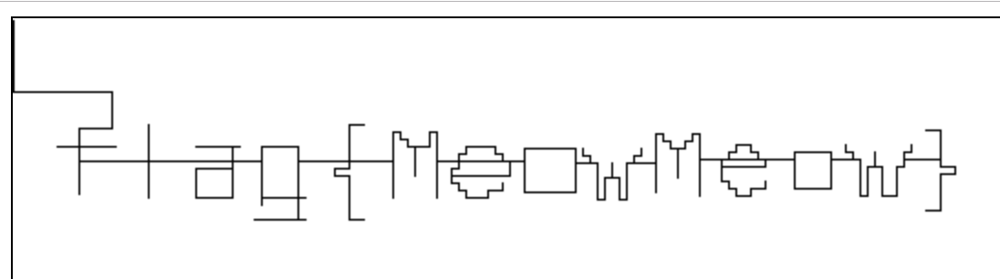

# 猫咪遥控器

欢迎来到猫咪系列题目之**猫咪遥控器**。

这道题是一道非常简单的题目，主要是想让同学们学会一些程序画图的技巧。

根据题目提示，我们需要将控制序列画出来，并且我们根据常识和题目提示，能知道：

UDLR 分别代表：上（UP）下（DOWN）左（LEFT）右（RIGHT）。

## 解法一：传统而可靠的办法

找一张纸（需要比较大的），花一下午即可。

## 解法二：使用 JS Canvas

我觉得这是最简单的一个办法，编程和解题都借助常见的浏览器（比如 Chrome）即可完成，我的解题代码如下：

```html
<!DOCTYPE html>
<html lang="en">
<head>
    <meta charset="UTF-8">
    <title>Cat Controller</title>
    <style>
        #path {
            border: 1px solid #000000;
        }
    </style>
</head>
<body>
<canvas id="path" width="1200" height="300"></canvas>
<script>
    var seq = "DDDDDDD...DDDLLLLLLLL"; // 题目中的序列
    var ctx = document.getElementById('path').getContext('2d');
    var x = 0, y = 0;
    
    function move(type) {
        switch (type) {
            case 'U': y -= 1; break;
            case 'D': y += 1; break;
            case 'L': x -= 1; break;
            case 'R': x += 1; break;
        }
        ctx.fillRect(x, y, 1, 1);
    }
    
    for (var i = 0; i < seq.length; i++) {
        move(seq[i]);
    }
</script>
</body>
```

把上面的代码保存为 remote.html，用浏览器打开即可得到路径：




flag: `flag{MeowMeow}`
