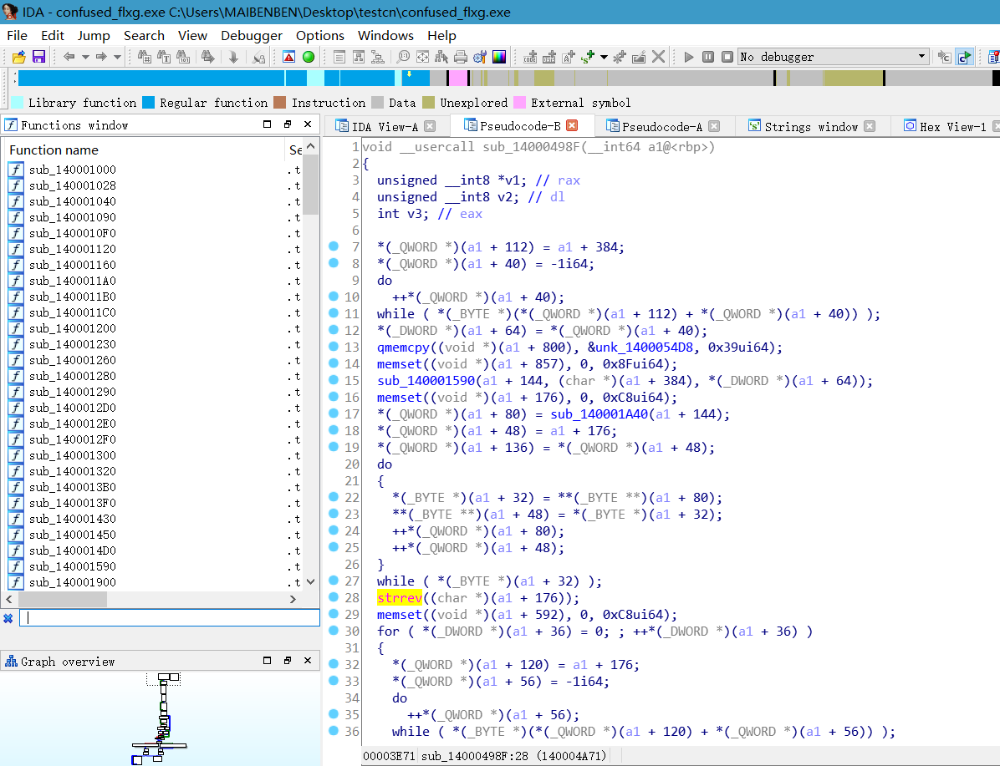
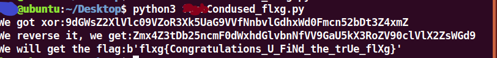

# 困惑的 flxg 小程序

在民间流传着这样一个传说，智慧的老者有一个神秘的魔镜，每当有人向老者提出自己的疑惑，老者将轻轻抚摸镜面，此时魔镜发出了古老的声音，诉说着做法的对错。无数的年轻人通过老者向魔镜请教，他们留下了一个个不朽的神话。过了很久很久……人们进入了工业时代，又过了很久进入了电器时代，随着人们对于自然理解，人们进入了原子能时代。人们似乎忘记了久远的传说。但是智者却以其他形式的方式再次出现在了人们的生活之中。小冉同学像是天之娇子，他在互联网上发现了一个这样的神秘程序，输入一段文字，神奇的程序会告诉你它是否正确。或许这就是21世纪的魔镜。魔镜里到底隐藏着多少不为人知的秘密，冉同学能发现这魔镜里的秘密吗?

[打开题目](src/confused_flxg.exe)

---

我们先把程序拖入 IDA，等 IDA 分析完毕后，我们先从所有字符串下手！

​	

拖入 IDA，一般来说都先从字符串入手，有一个像是生成 base64 的字符串,还有一个像是逆序的 base64 字符串，解出来:`flxg{I_am_A_fake_flag_23333}`。恩，好吧，那我们看看程序别的信息，我们会发现有一个进入异常的 string。可能这道题目和 C++ 异常有关，看到那么多函数，瞬间有点懵，没事慢慢来，先看哪些系统函数被调用了：


我们看到如此多的函数，我们找到结尾为 `498F` 的这个函数，里面运用了 `strrev` 来翻转字符串。恩，这应该就是解密函数。
我们来分析这个解密函数。
`qmemcpy((void *)(a1 + 800), &unk_1400054D8, 0x39ui64);`

此句将一串怪异的字符串复制到了一个内存地址。我们跟随一下这个地址里面的内容
  

```C
00000001400054D0  0A 00 00 00 00 00 00 00  39 65 45 54 77 5F 34 5F  ........9eETw_4_
00000001400054E0  64 5F 66 68 3C 34 58 55  7F 43 21 4B 7F 20 43 76  d_fh<4XU.C!K. Cv
00000001400054F0  5F 20 4C 4D 7A 53 70 7D  56 4D 65 47 4C 5D 71 43  _ LMzSp}VMeGL]qC
0000000140005500  18 6F 47 48 42 18 1C 4D  74 45 01 69 00 4D 5B 6D  .oGHB..MtE.i.M[m
```

我们接着分析经过 `sub_140001590()` 函数后将一块内存地址初始化为 0。

我们继续分析

```C
do
  {
    *(_BYTE *)(a1 + 32) = **(_BYTE **)(a1 + 80);
    **(_BYTE **)(a1 + 48) = *(_BYTE *)(a1 + 32);
    ++*(_QWORD *)(a1 + 80);
    ++*(_QWORD *)(a1 + 48);
  }
```

这一段代码类似于 `strcpy()`

接着我们看到了调用了 `strrev` 函数，这个函数翻转了字符串的内容。

接着我们往下看

```C
*(_BYTE *)(a1 + *(signed int *)(a1 + 36) + 592) = *(_BYTE *)(a1 + 36) ^ *(_BYTE *)(a1+ *(signed int *)(a1 + 36) + 176);
```

这是在 `for` 循环里的 xor 操作，`*(_BYTE *)(a1 + 36)`就像我们的 `i` 循环变量。

之后就没有什么加密的操作了。

我们将我们发现的那一段字符串整理出来。


我们跟据我们的分析来写解密程序：

```Python
#!/usr/bin/env python3
import base64
gotlist = "39 65 45 54 77 5F 34 5F 64 5F 66 68 3C 34 58 55 7F 43 21 4B 7F 20 43 76 5F 20 4C 4D 7A 53 70 7D 56 4D 65 47 4C 5D 71 43 18 6F 47 48 42 18 1C 4D 74 45 01 69 00 4D 5B 6D".split()
flxg = ""
ccc = 0
for i in gotlist:
    flxg = flxg + str(chr(int("0x"+i,base=16)^ccc))
    ccc = ccc + 1

print("We got xor:" + flxg)
flxg = flxg[::-1]
print("We reverse it, we get:" + flxg)
flxg = base64.b64decode(bytes(flxg,'utf-8'))
print("We will get the flag:" + str(flxg))
```

运行后我们就得到了我们的 flxg：
