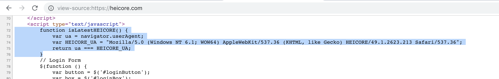
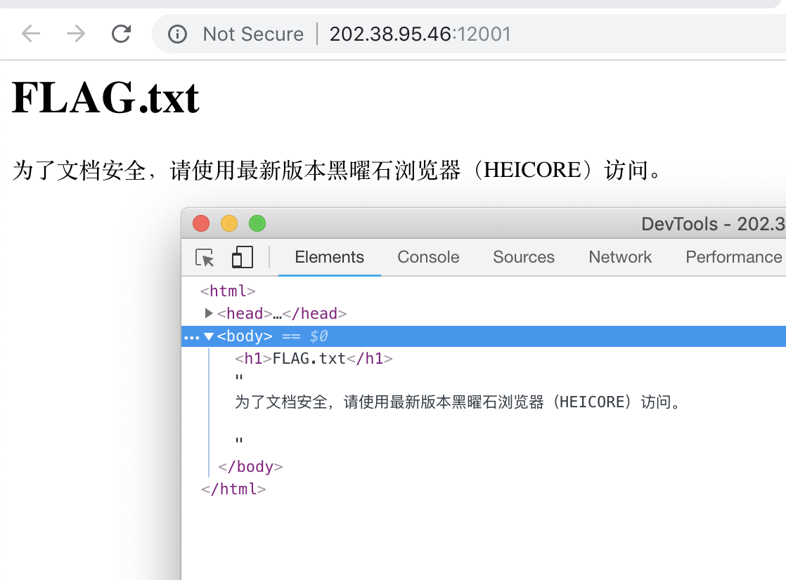
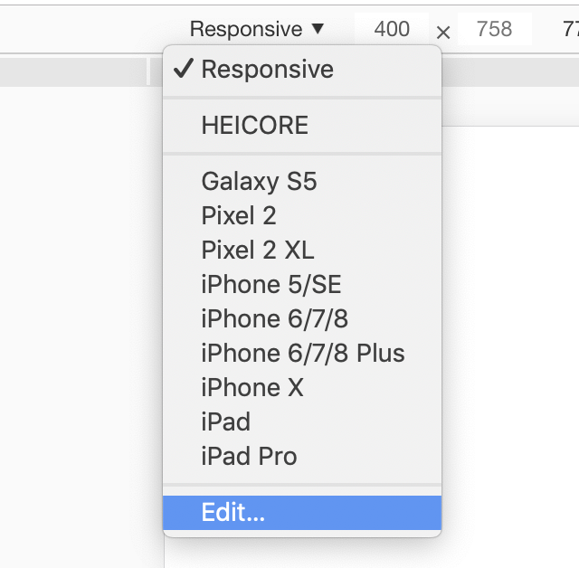
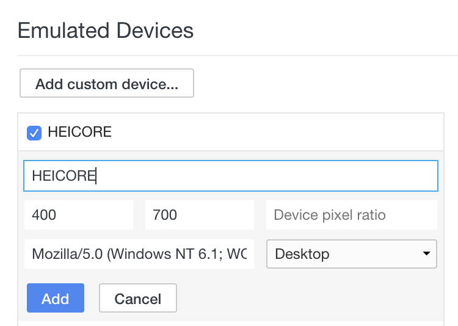
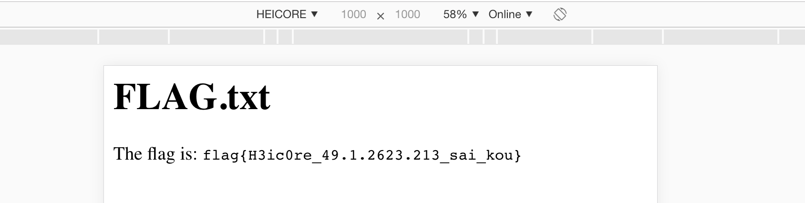

# 黑曜石浏览器

欢迎大家来到本次比赛的明星题目——黑曜石浏览器，这道题目是一道非常简单但是很有趣的题目。

首先打开题目，发现提示"请使用最新版本黑曜石浏览器（HEICORE）访问"。

所以我们的思路就是伪装自己是黑曜石浏览器。

## 解法

上网搜索“黑曜石浏览器 HEICORE”，除了百度以外的所有搜索引擎几乎都能找到该浏览器的官网：heicore.com。

我们打开把玩一整，发现下载，登陆，注册都是无效的。

而且这个浏览器主页还做了很多恶心人的限制，比如禁用了快捷键，打开控制台就会崩溃，伪造了当前页面的地址为 `index.php`（其实是 `index.html`）。

不过我们可以直接通过直接浏览源代码来查看这个页面是怎么判断我们是不是黑曜石浏览器。

- 方法一：view-source

在 Chrome 浏览器地址栏中输入：

```
view-source:https://heicore.com
```



可以找到判断 User-Agent 的核心逻辑，就是判断 User-Agent 是否为：

```
Mozilla/5.0 (Windows NT 6.1; WOW64) AppleWebKit/537.36 (KHTML, like Gecko) HEICORE/49.1.2623.213 Safari/537.36
```

User-Agent（UA） 是每个浏览器最大的不同的特征，所以可以猜测题目中的 FLAG.txt 需要我们以这个 UA 来访问。

- 方法二：curl

```
curl https://heicore.com
```

和查看源代码是一样的效果。


然后就是尝试使用这个 UA 访问 FLAG.txt。

- 方法一：使用 Chrome 控制台



点击左上角那个手机平板图标，然后：



通过 Edit 添加一个叫做 HEICORE 的设备：



UA 就填刚才得到的 UA。

然后回到页面，选择这个 Device，刷新即可（注意此时不要关闭控制台窗口）。




- 方法二：curl

```shell
curl http://202.38.95.46:12001/ -H "User-Agent: Mozilla/5.0 (Windows NT 6.1; WOW64) AppleWebKit/537.36 (KHTML, like Gecko) HEICORE/49.1.2623.213 Safari/537.36"
```

即可得到 flag。


flag: `flag{H3ic0re_49.1.2623.213_sai_kou}`