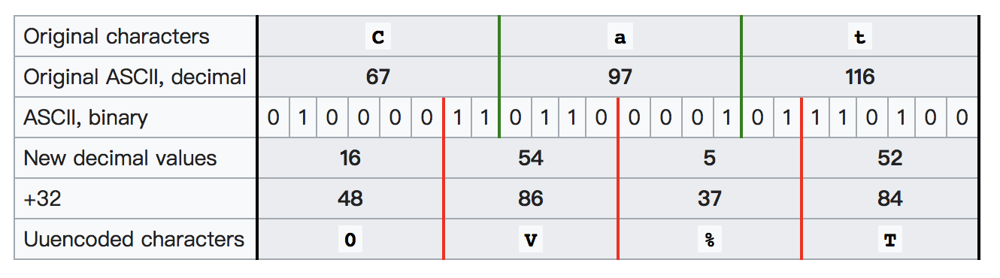

# 她的诗

当我得知这道题出现了非预期解时，我的内心是崩溃的。如果您是用非预期解完成的题目（表现为：得到了 flag，但完全不知道为什么），请先查询资料，思考一下为什么会存在这个非预期解，然后继续看这篇 writeup。~~顺便想给某站点的站长致以亲切友好的问候。~~

## 预期题解

运行 `helper.py` 可以得到诗的内容，但比较明显的事情是，重点不在这个脚本可以解码出的诗上——如果是的话，我没有必要再去绕一大圈编码再写解码脚本发给你；而且题干里面也是有暗示的。

> 「我要提醒一下你，只纠结于字面意思是很费劲的，而且……你不会得到任何有用的结论。」

我都这么说了啊……

`helper.py` 里面的 `begin 666 <data>` 是什么？搜索引擎可以很快告诉你，这是 uuencoding 编码。可以看到，这个脚本将文件的每一行当作一个被 uuencoding 编码后的文件进行解码。如果你去试一下，会发现一大部分明文行重新编码之后获得的字符串和原文件在末尾的地方不一样。那么很明显，这里有问题。

Uuencoding 编码的结构是这样的：

```
 <length character><formatted characters><newline>
```

第一个是长度字符，通过长度 + 32，再转成 ASCII 的方式出现（比如说，有 3 个字符，就是 `chr(3 + 32)`，即 `#`）。之后每三个字节（字符）为一组，以如下的方式编码：



*（摘自[维基百科对应页面](https://en.wikipedia.org/wiki/Uuencoding)）*

但不是每一行的字符都是 3 的倍数，那么如果最后一组没法填充的话（即长度乘 4 模 3 不为 0），那么对应部分就会填 0。那么我们想要隐藏的东西能不能就这样塞在填 0 的部分里面呢？答案当然是可以的，不然就没有这道题目了。

获得 flag 的做法中其中一种是一行一行用位运算的方式把 flag 的每个比特拼起来；另一种特定于这道题的方式是：直接扩大每行第一个长度字符到正确的值，具体的原因见下。

## 非预期题解

那么非预期题解是怎么回事呢？在出题的时候，因为 flag 很长，为了让「诗」短一点，把所有能用的比特都用上了，但是：

- 如果最后一组只有一个字符，那么最多能填 16 位。
- 只有两个的话，就是 8 位。

发现什么问题了吗？**它们都是 8 的倍数，即一个字符位数的倍数**。在大多数的实现中，解码都是正常的，但是**如果有 uuencoding 解码的实现忽略了表示长度的第一个字符**，并且你找到了这个实现，那么……就可以无脑获得 flag。

（对我来讲）悲痛欲绝的是，想找到这个不太正常的实现并不难。


*（图文无关 \* 2）*

这是我出题时候的疏忽，向各位道歉。

## 修复版本

这是修复了「她的诗」非预期解的版本：[https://github.com/taoky/her_poem_fixed_version](https://github.com/taoky/her_poem_fixed_version)。如果您用了非预期解完成原题，我强烈建议再试一下我微调后的题目。

## 花絮

后台看提交记录的时候，各位提交的 flag 千奇百怪，很心疼真跑去文本分析诗句和脚本写得有问题的同学。比如说这位同学，一直在正确 flag 的边缘徘徊：

还有这位：


我想表扬一下这位同学，他/她提交的 flag 证明了自己使用搜索引擎的能力，虽然……很遗憾，方向……是完全错误的。

另外的话，这道题是「她的诗」，不是 [请使用最新版黑曜石浏览器查看] 的诗啊……为什么会有人提交那种 flag 啊😂

