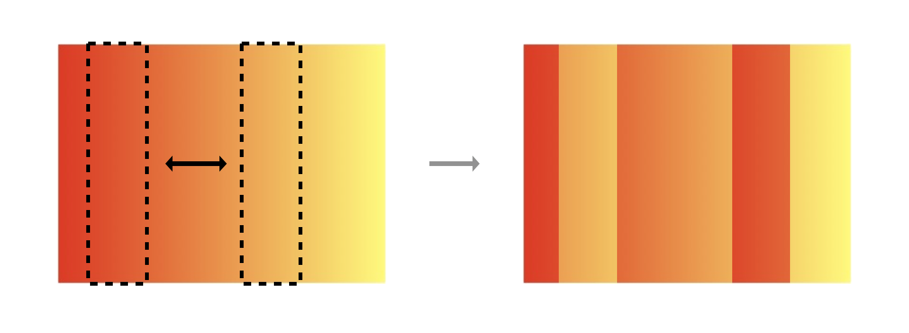
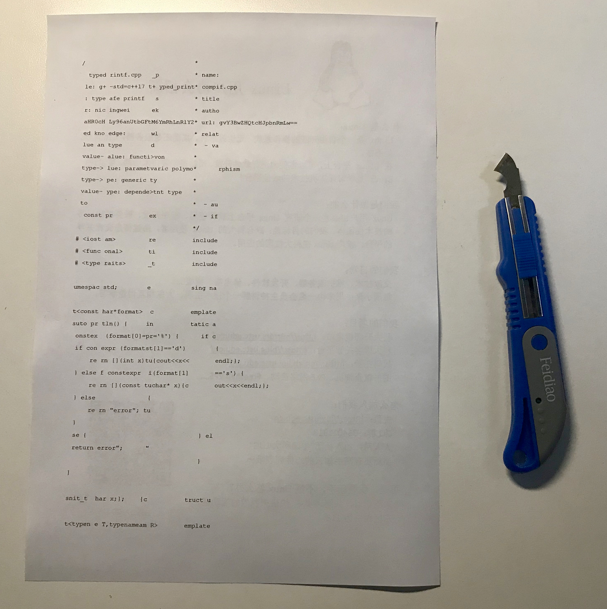
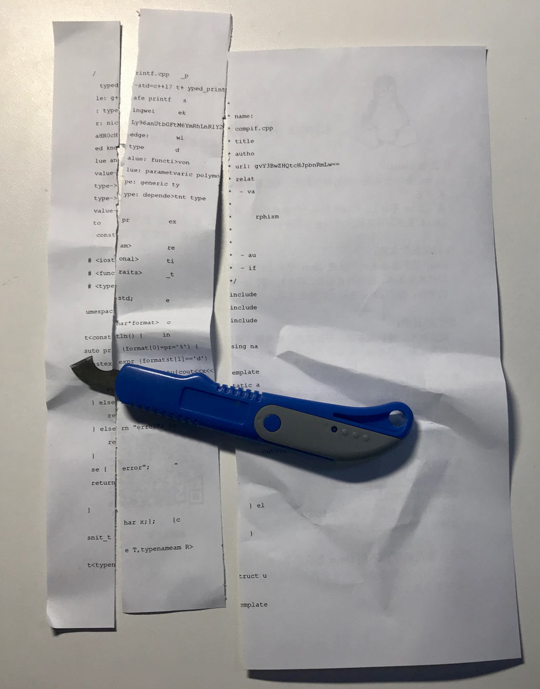
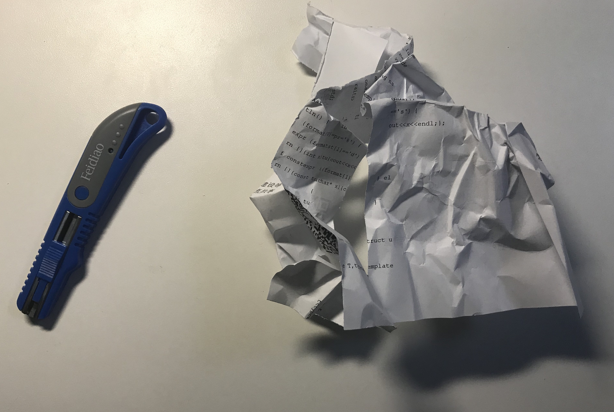

# 猫咪和键盘

欢迎来到猫咪系列题目之**猫咪和键盘**。

这道题是一道非常简单的题目，主要是想让同学们学会一些文本编辑的技巧。

## 解法一：一种原始而可靠的办法

经过粗略观察，我们就可以发现这应该是一个 C++ 源代码，而代码被以“若干列”为单位打乱了。



我们的思路也很简单，就是先以“若干列”为单位将代码还原。

第一步：打印代码；

 

第二步：裁剪代码；



第三步：我编不下去了……



当然，只要足够有耐心，这个方法确实是原始而可靠的。

## 解法二：文本编辑器的进阶技巧

21 世纪，许多编辑器都提供了“列编辑”模式，就我所知，以下常见的编辑器都是支持列编辑模式的：

### VS Code

Windows/Linux:

- `Alt + 鼠标左键` ：可以添加多个光标；
- `Shift + Alt + 拖动鼠标左键`：可以选中多列；

macOS:

- `shift + option + 左键`：可以选中多列；

### Sublime Text

- `Shift + 鼠标右键`；
- `鼠标中键`；

- 选中需要进行列编辑的多行，然后按下 `Ctrl + Shift + L`；

### Vim

- Normal mode: `Ctrl + v`

### Emacs

直接（或使用 `C-x SPC`）选定矩形区域的左上角和右下角，

- `C-x r k` 剪切该矩形选区；
- `C-x r y` 插入矩形选区。

任选一款文本编辑器，都可以轻松将代码还原。

还原后的代码大概长这个样：

```cpp
/*
 * name: typed_printf.cpp
 * compile: g++ -std=c++17 typed_printf.cpp
 * title: type safe printf
 * author: nicekingwei
 * url: aHR0cHM6Ly96anUtbGFtYmRhLnRlY2gvY3BwZHQtcHJpbnRmLw==
 * related knowledge:
 *  - value and type
 *      value->value: function
 *      type->value: parametric polymorphism
 *      type->type: generic
 *      value->type: dependent type
 *  - auto
 *  - if constexpr
 */
#include <iostream>
// 。。。
```

根据提示，使用 `g++ -std=c++17 typed_printf.cpp` 编译并运行 `./a.out` 即可得到 flag。

## 冷知识

这一段代码是来自 ZJU Lambda 的 nicekingwei 同学：

主办方能用我的代码来出题，我感到很荣幸，虽然题目并不是考 cpp 元编程或 dependent type 之类的东西（那就成了 pl 知识竞赛了233）。其实我个人并不是很喜欢 cpp，因为实现一个 typed printf 都要这么麻烦(>_>)。最后打个广告吧？欢迎大家加入 ZJU Lambda 和我们一起讨论 pl/fp 相关知识，虽然我们大部分时间是在吹水和复读……（各位都是参加 ctf 比赛的，群号应该不用我放了吧嘻嘻）
