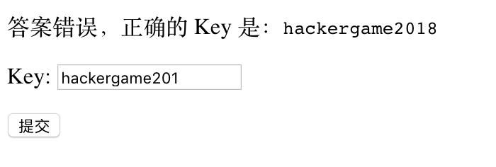
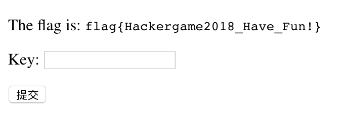
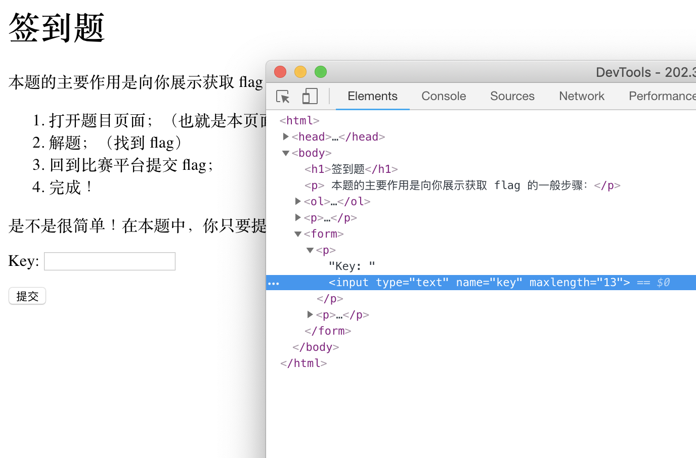

# 签到题

这道题目是我设置在 Hackergame 2018 中的第一道题，其目的只是想更精确的统计一下参赛人数，然而没想到本题也成为了本次比赛中命题组给出最多答复次数的题目。

回到题目本身，这道题目有一个输入框，根据提示需要输入 `hackergame2018`，然而细心的同学已经发现了，无论是通过输入还是粘贴的方法都会缺少一个数字 `8`。

解决问题的方法至少有以下几个：

## 解法一：观察地址栏

CTF 需要视力！只需要观察到地址栏中 `?key=hackergame201` ，将其改为 `?key=hackergame2018` 并回车就可以得到 flag。

## 解法二：审查元素

使用 Chrome 浏览器，在输入框上右键点击审查元素（Inspect）可以看到：

一个叫做 `maxlength="13"` 的东西，我们双击它，修改为大于等于 14 的数字或删除即可。
