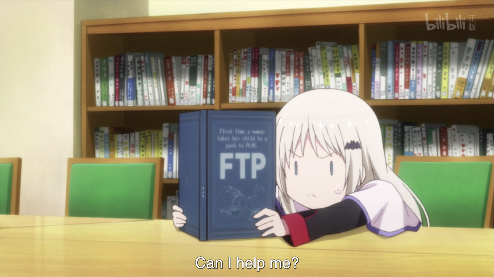

# 我是谁

高中的时候，为了提高作文成绩，小 T 买了一本关于哲学的大众读物。虽然到最后，书确实是差不多看完了，但是并没有什么用。

在他看完这本书之后的某一天，小 T 做了一个梦，他梦见自己变成了一台服务器。作为阅读那本书的后遗症（之一），他不禁开始思考生命的本源之类乱七八糟的问题。到最后，他在纠结的，只有一件事情：

「我是谁？」

[打开题目](http://202.38.95.46:12005/)

---

大家好，我是小 T，听说这几天你们都在找我，~~希望与我一起讨论哲学与文学（大误）~~。首先非常感谢大家参与 hackergame 2018，这是我第一次为这样的比赛出题，有这么多人回答出了我的题目，我感到非常感动。

废话不多说了。接下来是「我是谁」的 writeup。

这道题是在 hackergame 题目准备末期出的，因为需要一些简单的题目。灵感来源是我在大一上半学期的时候，在「[计算机导论](http://mis.teach.ustc.edu.cn/queryxkkccx.do?kcid=2430&bjbh=01104401&xnxq=20181&comefrom=kb)」（大致是计算机的简单概念入门课程）课上玩手机的时候——那时候刚好在讲网络——看到了[维基百科的 HTTP Status Code 的页面](https://en.wikipedia.org/wiki/List_of_HTTP_status_codes)，发现里面有一个非常搞笑的代码，就是你们在这道题里面看到的 418 I'm a teapot。

这就是第一小题（哲学思考）的题解，其实只要在页面上打开开发者工具，在 Network 部分就能看到解答了（致萌新：如果你什么都没看到，刷新一下页面）。只要输入的内容小写之后包含 teapot 这个单词，就能拿到 flag，这里我根本没有打算为难别人。（不过可以试试输入 coffee 会发生什么）

至于第二小题的话……Can I help me?

*（图文无关）*

其实本来是没有第二小题的，但是有人希望我实现 HTCPCP-TEA，于是就……

页面提醒尝试用其他的 *methods* 来请求页面。我承认这里确实需要一点点脑洞……这里的 method 其实是指 [Request method](https://en.wikipedia.org/wiki/Hypertext_Transfer_Protocol#Request_methods)，直接点击链接的话使用的是 GET 来连接的。不过如果你尝试用 POST 来请求页面的话，会有非常清楚的提示：

> The method "POST" is deprecated.
>
> See RFC-7168 for more information.

去读 [RFC-7168](https://tools.ietf.org/html/rfc7168) 就行了。根据：

> To this end, a TEA-capable pot that receives a BREW message of content type "message/teapot" MUST respond in accordance with the URI requested, as below.

最终使用 BREW 请求页面，且带上 `Content-Type: message/teapot` 请求头的时候，页面会在 `Alternates` 响应头给出真正可以泡红茶的 URL。用相同的方式请求那个 URL，就能获得第二个 flag。（其实还隐藏着一些彩蛋，可以试试）

嗯？你说不知道怎么请求？发送特定请求的方式有很多，这道题中可以使用的一种方式是使用 `curl` 的 `-I`, `-X` 和 `-H` 参数来完成。具体内容可以查看 `man curl`。用 BurpSuite 等工具，甚至是 Firefox 的开发者工具改请求也都是可以的。

其实第二小题的协议实现还可以再逼真一些，但是出于 Flask 的限制，加上时间有一些仓促，所以没有实现，不然这道题还可以更真（qiàn）实（biǎn）得多。至于有人问是否有实现了 HTCPCP-TEA 的茶壶~~手办~~嘛……反正我是没有，不过我很期待有人能做出来。