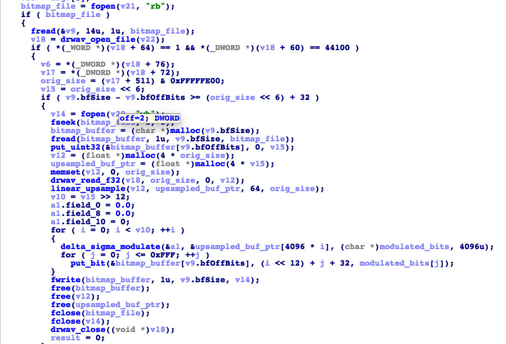

# Writeup for USTC CTF 2018

emmm 自己是第一次参加 CTF，所以写的不是很好，各位 dalao 看到什么不对的地方麻烦指出~

这里就写一下自己觉得和其它解法不是特别像的题目啦

# 游园会的集章卡片

## 解法 1

打印下来，剪纸，让你女朋友拼图 ：）

## 解法 2

然而我并没有女朋友，所以采用解法 2。

代码见 https://github.com/ProfFan/jigsaw-solver

将图片重命名成 `1-25.jpg`，放到 `generated_pieces` 目录下，运行程序即可得到拼合完成的图片。

# 数理基础扎实的发烧友

下载题目可执行文件的名称已经非常清楚了，初步估计是 LSB 隐写。IDA 反汇编 `stegan.exe` 之后整理代码：



此处因为已知读取的是 BMP 文件，且第一个 `fread` 只有 14bit，所以可以断定此处是 BMP 头。在 IDA 的 structure 窗口加入 BMP 头 `BITMAPFILEHEADER` 的定义，并指定 v9 的 type 可以方便反汇编。

代码可以说是非常明白了，关键函数名也没有混淆。大体流程就是：
1. 读 BMP 文件
2. 读 WAV 文件
3. 将音频信号上采样 64 倍得到一个高采样率的信号
4. 进行二阶 Delta-sigma 调制得到二进制信号
5. 将该信号隐写到 LSB

此处的 `a1` 是一个结构体用来存放当前 ADC 的状态（当然不知道也没关系hhhh）。
因为是 Delta-sigma 调制，解调非常简单，直接送入低通滤波器即可。
滤波器的阶数需要高一些以抑制高频谐波。最后下采样64倍得到44100Hz的音频。

观察可知是 DTMF 波形，简单处理即可得到 flag。

题解可见附件 Jupyter Notebook。

# 对抗深渊

打开文件就发现有一个醒目的 `NEAREST` hhhhh
本题其实是最简单的反向梯度法就可以了，因为最终有效像素只有 900 个。

打开 PyTorch 的官网即可看到相关教程，copy paste 即可解出。

此题关键是要 normalize 输入的图片：
```
target = preprocess_image(target)
sample = preprocess_image(sample)
target = (target - 0.1307) / 0.3081
sample = (sample - 0.1307) / 0.3081
```

之后进行 fgsm attack，并修改关键像素即可。

代码：
```
def fgsm_attack(image, epsilon, data_grad):
    # Collect the element-wise sign of the data gradient
    sign_data_grad = data_grad.sign()
    # Create the perturbed image by adjusting each pixel of the input image
    perturbed_image = image + epsilon*sign_data_grad
    # Adding clipping to maintain [0,1] range
    #perturbed_image = torch.clamp(perturbed_image, 0, 1)
    # Return the perturbed image
    return perturbed_image

def postprocess(x,orig_r):
    ratio = 20
    print("Ratio:", ratio)
    for i in range(x.shape[0]):
        for j in range(x.shape[1]):
            orig_r[i*ratio + (ratio//2)][j*ratio + (ratio//2)] = x[i][j]
    return orig_r
```

代码见附件 `adversarial.py`。

# 加密算法和解密算法

本题的算法采用了 brainfuck 进行加密。我们可以使用 [BF Optimizing Compiler](https://www.nayuki.io/page/optimizing-brainfuck-compiler)将其转化为 C 代码，如下：
```
int32_t mem[1000000] = {0};
int32_t *p = &mem[1000];

int8_t in;
in = read();
p[1] = in * 8;

p[2] += in * 7;
p[3] += in * 6;
p[4] += in * 5;
p[5] += in * 8;
p[6] += in * 3;
p[7] += in * 9;
p[8] += in * 2;
p[9] += in * 3;
p[10] += in * 4;
p[11] += in * 6;
p[0] = 0;

p[2] += in * 8 * 2;
p[3] += in * 8 * 5;
p[4] += in * 8 * 2;
p[5] += in * 8 * 9;
p[6] += in * 8 * 4;
p[7] += in * 8 * 9;
p[8] += in * 8 * 4;
p[9] += in * 8 * 2;
p[10] += in * 8 * 9;
p[11] += in * 8 * 4;
p[1] = 0;
p[0] = read();
p[1] = p[0] * 8;
p[2] += p[0] * 5;
p[3] += p[0] * 3;
p[4] += p[0] * 8;
p[5] += p[0] * 3;
p[6] += p[0] * 6;
p[7] += p[0] * 8;
p[8] += p[0] * 7;
p[9] += p[0] * 6;
p[10] += p[0] * 7;
p[11] += p[0] * 6;
p[0] = 0;
p[2] += p[1] * 8;
p[3] += p[1] * 8;
p[4] += p[1] * 9;
p[5] += p[1] * 3;
p[6] += p[1] * 2;
p[7] += p[1] * 7;
p[8] += p[1] * 9;
p[9] += p[1] * 4;
p[10] += p[1] * 6;
p[11] += p[1] * 9;
p[1] = 0;
p[0] = read();
p[1] = p[0] * 8;
p[2] += p[0] * 8;
p[3] += p[0] * 8;
p[4] += p[0] * 7;
p[5] += p[0] * 5;
p[6] += p[0] * 2;
p[7] += p[0] * 3;
p[8] += p[0] * 2;
p[9] += p[0] * 4;
p[10] += p[0] * 9;
p[11] += p[0] * 3;
p[0] = 0;
p[2] += p[1] * 4;
p[3] += p[1] * 4;
p[4] += p[1] * 7;
p[5] += p[1] * 8;
p[6] += p[1] * 8;
p[7] += p[1] * 6;
p[8] += p[1] * 9;
p[9] += p[1] * 6;
p[10] += p[1] * 4;
p[11] += p[1] * 5;
p[1] = 0;
p[0] = read();
p[1] = p[0] * 8;
p[2] += p[0] * 5;
p[3] += p[0] * 6;
p[4] += p[0] * 9;
p[5] += p[0] * 5;
p[6] += p[0] * 3;
p[7] += p[0] * 6;
p[8] += p[0] * 4;
p[9] += p[0] * 8;
p[10] += p[0] * 4;
p[11] += p[0] * 3;
p[0] = 0;
p[2] += p[1] * 7;
p[3] += p[1] * 6;
p[4] += p[1] * 3;
p[5] += p[1] * 6;
p[6] += p[1] * 5;
p[7] += p[1] * 5;
p[8] += p[1] * 6;
p[9] += p[1] * 8;
p[10] += p[1] * 8;
p[11] += p[1] * 7;
p[1] = 0;
p[0] = read();
p[1] = p[0] * 8;
p[2] += p[0] * 7;
p[3] += p[0] * 7;
p[4] += p[0] * 4;
p[5] += p[0] * 5;
p[6] += p[0] * 4;
p[7] += p[0] * 5;
p[8] += p[0] * 3;
p[9] += p[0] * 9;
p[10] += p[0] * 7;
p[11] += p[0] * 7;
p[0] = 0;
p[2] += p[1] * 5;
p[3] += p[1] * 3;
p[4] += p[1] * 7;
p[5] += p[1] * 4;
p[6] += p[1] * 8;
p[7] += p[1] * 4;
p[8] += p[1] * 3;
p[9] += p[1] * 5;
p[10] += p[1] * 4;
p[11] += p[1] * 6;
p[1] = 0;
p[0] = read();
p[1] = p[0] * 8;
p[2] += p[0] * 5;
p[3] += p[0] * 7;
p[4] += p[0] * 2;
p[5] += p[0] * 9;
p[6] += p[0] * 4;
p[7] += p[0] * 4;
p[8] += p[0] * 3;
p[9] += p[0] * 7;
p[10] += p[0] * 6;
p[11] += p[0] * 2;
p[0] = 0;
p[2] += p[1] * 2;
p[3] += p[1] * 2;
p[4] += p[1] * 3;
p[5] += p[1] * 9;
p[6] += p[1] * 4;
p[7] += p[1] * 5;
p[8] += p[1] * 2;
p[9] += p[1] * 8;
p[10] += p[1] * 7;
p[11] += p[1] * 9;
p[1] = 0;
p[0] = read();
p[1] = p[0] * 8;
p[2] += p[0] * 6;
p[3] += p[0] * 6;
p[4] += p[0] * 7;
p[5] += p[0] * 8;
p[6] += p[0] * 3;
p[7] += p[0] * 3;
p[8] += p[0] * 6;
p[9] += p[0] * 4;
p[10] += p[0] * 8;
p[11] += p[0] * 2;
p[0] = 0;
p[2] += p[1] * 7;
p[3] += p[1] * 6;
p[4] += p[1] * 4;
p[5] += p[1] * 2;
p[6] += p[1] * 8;
p[7] += p[1] * 9;
p[8] += p[1] * 4;
p[9] += p[1] * 4;
p[10] += p[1] * 5;
p[11] += p[1] * 6;
p[1] = 0;
p[0] = read();
p[1] = p[0] * 8;
p[2] += p[0] * 9;
p[3] += p[0] * 3;
p[4] += p[0] * 8;
p[5] += p[0] * 5;
p[6] += p[0] * 6;
p[7] += p[0] * 5;
p[8] += p[0] * 7;
p[9] += p[0] * 8;
p[10] += p[0] * 9;
p[11] += p[0] * 2;
p[0] = 0;
p[2] += p[1] * 8;
p[3] += p[1] * 9;
p[4] += p[1] * 3;
p[5] += p[1] * 7;
p[6] += p[1] * 2;
p[7] += p[1] * 9;
p[8] += p[1] * 9;
p[9] += p[1] * 4;
p[10] += p[1] * 7;
p[11] += p[1] * 2;
p[1] = 0;
p[0] = read();
p[1] = p[0] * 8;
p[2] += p[0] * 2;
p[3] += p[0] * 8;
p[4] += p[0] * 8;
p[5] += p[0] * 7;
p[6] += p[0] * 2;
p[7] += p[0] * 7;
p[8] += p[0] * 6;
p[9] += p[0] * 4;
p[10] += p[0] * 5;
p[11] += p[0] * 4;
p[0] = 0;
p[2] += p[1] * 2;
p[3] += p[1] * 7;
p[4] += p[1] * 5;
p[5] += p[1] * 2;
p[6] += p[1] * 7;
p[7] += p[1] * 8;
p[8] += p[1] * 3;
p[9] += p[1] * 7;
p[10] += p[1] * 2;
p[11] += p[1] * 4;
p[1] = 0;
p[0] = read();
p[1] = p[0] * 8;
p[2] += p[0] * 9;
p[3] += p[0] * 5;
p[4] += p[0] * 7;
p[5] += p[0] * 2;
p[6] += p[0] * 5;
p[7] += p[0] * 2;
p[8] += p[0] * 4;
p[9] += p[0] * 5;
p[10] += p[0] * 2;
p[11] += p[0] * 5;
p[0] = 0;
p[2] += p[1] * 9;
p[3] += p[1] * 8;
p[4] += p[1] * 4;
p[5] += p[1] * 6;
p[6] += p[1] * 4;
p[7] += p[1] * 2;
p[8] += p[1] * 8;
p[9] += p[1] * 5;
p[10] += p[1] * 8;
p[11] += p[1] * 9;
p[1] = 0;
p[2] += 2;
putchar(p[2]);
p[3] += 6;
putchar(p[3]);
p[4] += 8;
putchar(p[4]);
p[5] += 8;
putchar(p[5]);
p[6] += 3;
putchar(p[6]);
p[7] += 5;
putchar(p[7]);
p[8] += 5;
putchar(p[8]);
p[9] += 7;
putchar(p[9]);
p[10] += 4;
putchar(p[10]);
p[11] += 9;
putchar(p[11]);
p += 11;
```

此时你当然可以手算系数，但是我们可以看出代码实际是一个有限域下的线性变换，故我们可以通过取特殊值得到 Ax+b：

取 全 0 `echo '\x00\x00\x00\x00\x00\x00\x00\x00\x00\x00' | ./enc | od -tu1` 得 到
```
0000000     2   6   8   8   3   5   5   7   4   9
0000012
```
每 个 Byte 各 取 1 得 到
```
echo '\x01\x00\x00\x00\x00\x00\x00\x00\x00\x00' | ./enc | od -tu1
0000000    25  52  29  88  38  86  39  26  80  47
0000012
```
等等

将它写成矩阵形式：
```
S=
[25,52,29,88,38,86,39,26,80,47],
[71,73,88,35,25,69,84,45,59,87],
[42,46,71,77,69,56,79,59,45,52],
[63,60,41,61,46,51,57,79,72,68],
[49,37,68,45,71,42,32,56,43,64],
[23,29,34,89,39,49,24,78,66,83],
[64,60,47,32,70,80,43,43,52,59],
[75,81,40,69,25,82,84,47,69,27],
[20,70,56,31,61,76,35,67,25,45],
[83,75,47,58,40,23,73,52,70,86]

b=
[2,6,8,8,3,5,5,7,4,9]

A=
[23, 46, 21, 80, 35, 81, 34, 19, 76, 38],
[69, 67, 80, 27, 22, 64, 79, 38, 55, 78],
[40, 40, 63, 69, 66, 51, 74, 52, 41, 43],
[61, 54, 33, 53, 43, 46, 52, 72, 68, 59],
[47, 31, 60, 37, 68, 37, 27, 49, 39, 55],
[21, 23, 26, 81, 36, 44, 19, 71, 62, 74],
[62, 54, 39, 24, 67, 75, 38, 36, 48, 50],
[73, 75, 32, 61, 22, 77, 79, 40, 65, 18],
[18, 64, 48, 23, 58, 71, 30, 60, 21, 36],
[81, 69, 39, 50, 37, 18, 68, 45, 66, 77]
```

在 GF(2^6) 上取矩阵逆即可得到 flag。

代码见 Jupyter Notebook。

# 