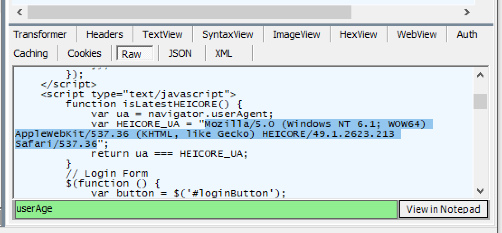
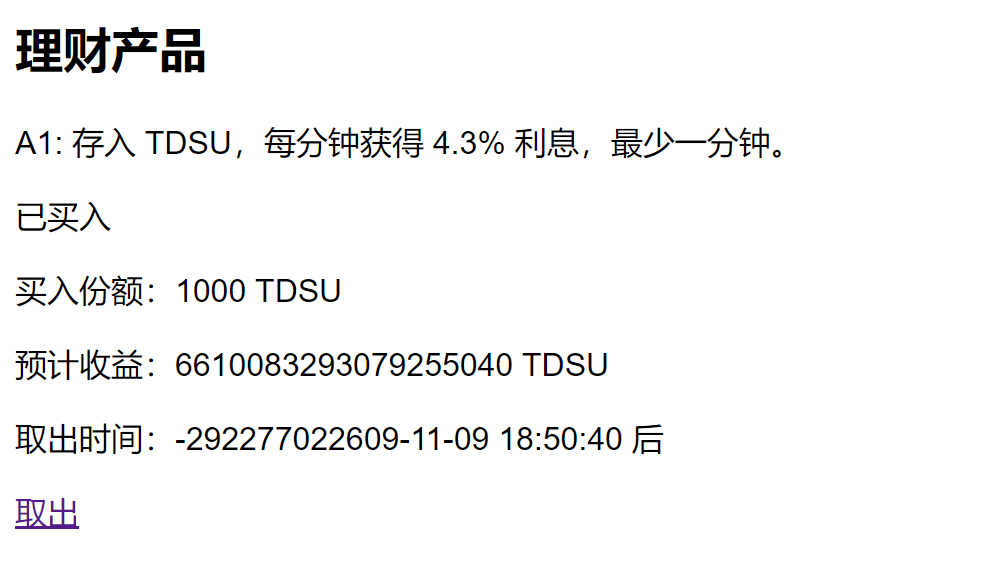
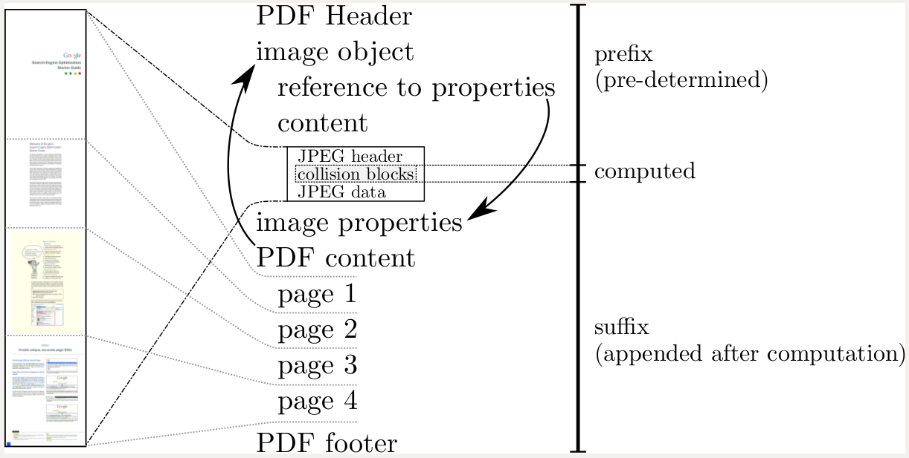
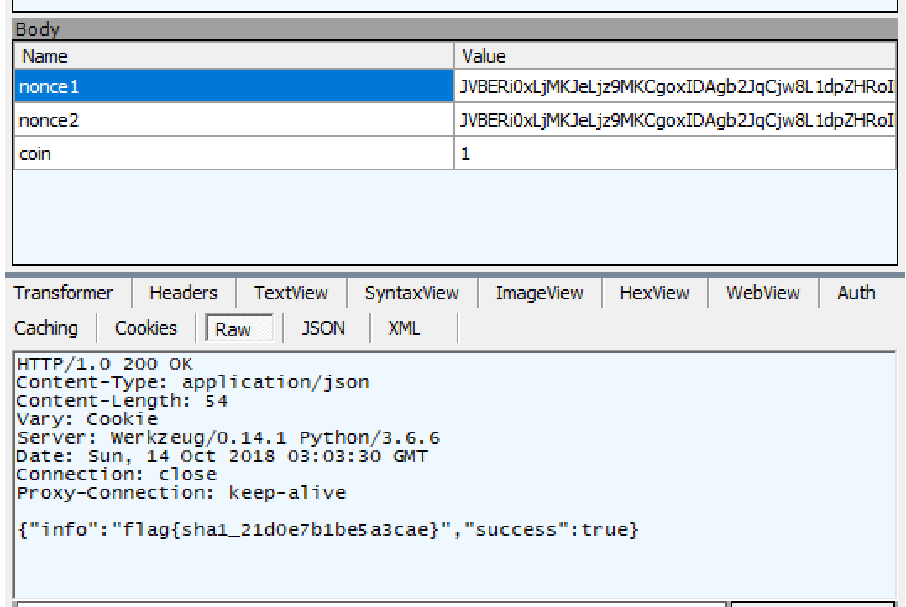
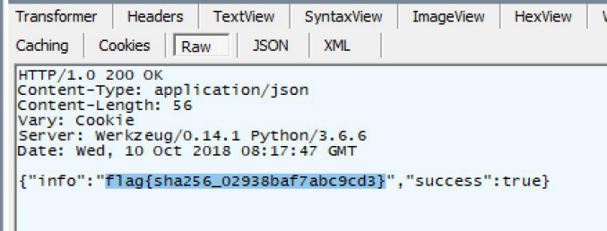
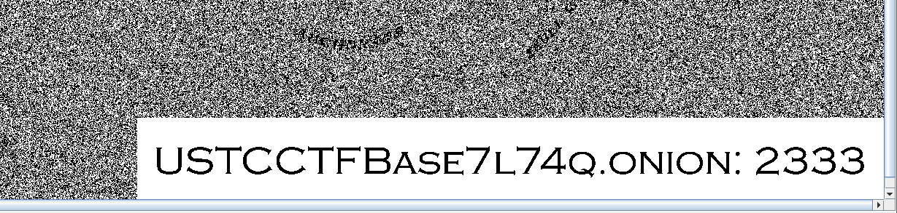

# Hackergame 2018（中科大 CTF）write up
by Coxxs (twitter.com@Coxxs.21d0)

一个对新手很友好的 CTF，一个很有趣的 CTF，也是让我烧了几天脑的 CTF..

## 黑曜石浏览器 150


看到题目猜测是要修改 User-Agent 头，于是在 User-Agent 字串里添加了 HEICORE 字符，无果。

网上找找这个黑曜石浏览器到底是个什么玩意，发现主办方竟然真的建了一个[黑曜石浏览器官网](https://heicore.com/index.html)。

于是试图下载..


好吧那就注册一下..


**(／‵Д′)／~ ╧╧**

给我呈上开发者工具！然而右键似乎被网页禁止了.. 于是按下 F12..


刷新一下试试？


**(／‵Д′)／~ ╧════════════╧**

最后冷静下来，发现每次打开首页的时候，地址栏都会微妙的从 index.html 快速闪成 index.php，猜测是用了 `history.replaceState` 来进行干扰。页面实际应该是 index.html。

默默打开 Fiddler，配好 https 解密，清掉浏览器缓存，然后重新访问 index.html，最终找到了一堆干扰开发者工具的代码，以及最重要的， User-Agent 判断逻辑。



带上新的 User-Agent，访问最初的页面..


（这也是红X浏览器使用的 Chromium 内核的版本号）

**flag{H3ic0re_49.1.2623.213_sai_kou}**


## 猫咪银行 150

（我真的没看出 CTB 其实是 BTC，RMX 其实是 XMR，TSDU 其实是 USDT）

总共给 10 分钟时间，每次操作都有 2 秒的限制。

一开始猜测是金融相关的题目。试试前 20 秒把 CTB 全部换成 TDSU，然后每分钟存入理财产品并取出来利滚利，总共可以存 9 轮，最终再换回 CTB。

> 10 CTB * 1.043^9 ≈ 14.607 CTB

FLAG 碎片售价 20 CTB，根本不够。

尝试第二种方法，注意到 CTB、RMX、TDSU 之间的兑换汇率有差异（57 * 115 < 6606），试图通过兑换来刷钱。但由于有 2 秒的时间限制，10 分钟根本刷不到 20 个 CTB。

后来又试了试理财产品能不能买入负数，果然做了判断.. 但突然想到以前一个买超大数来溢出的方法，试着对买入**时间**（买入份额不行）输入 MAX_INT64 (9223372036854775807)，发现系统显示出现了异常。


看来这里应该就是漏洞点了。多次尝试，最终选定了 MAX_INT64 / 60 (153722867280912930) 这个数。



由于取出时间为负数，可以立即取出。获得巨款后，兑换回 CTB，最终成功购买 FLAG。


## 家里有矿 750

本题包含三小题，分别是使用 SHA1、MD5、SHA256 挖矿，虽然只更换了 Hash 方法与 Suffix（后缀）长度，但三小题的解法各不相同，相当有趣。


简单分析题目，玩家可以请求服务器下发一个 Suffix，在 60 秒内，玩家需要找出两个不同的 nonce，使得：

```
PopCount(~(Hash(nonce1 + suffix) ^ Hash(nonce2 + suffix))) >= n

// 其中 ^ 为按位异或，~ 为按位取反，PopCount 为求比特位 1 的个数, suffix 为 [a-zA-Z0-9] 内的字符
// 简单地说，就是两个 hash 中相同的比特位需不少于 n
// suffix 与 n 由服务器下发
// Hash = SHA1 时，strlen(suffix) = 4，n = 140
// Hash = MD5 时，strlen(suffix) = 16，n = 102
// Hash = SHA256 时，strlen(suffix) = 1，n = 199
```

### SHA1 150
SHA1 长度 20 字节，也就是 160 bits。160 位里要撞上 140 位，相当于只能有 2.5 个字节不同，怎么想都不能硬来。


前些年谷歌正好[发布过 SHA1 的碰撞](https://shattered.io/)，但需要 110 个 GPU 算一年，也不太现实。不管如何，先看看谷歌发布的两个碰撞样例 pdf 文件的结构。



[图片来源](https://shattered.io/static/pdf_format.png)，两个文件唯一不同的部分是 collision blocks 部分

从图上看出，collision blocks 后的部分是算完碰撞后才添加的。测试后发现，同时修改两个文件的 suffix，两个文件的 sha1 依然保持一致。

这正好符合本题要求，只要用上谷歌计算好了的 prefix 及 collision blocks，使 nonce(1/2) = prefix + collision blocks(1/2)，因为两块 collision blocks 是不同的，所以  `nonce1 ≠ nonce2` ，但依然可以做到 `sha1(nonce + suffix) == sha1(nonce2 + suffix)`（PopCount = 160 >= 140）。

从网上找到 prefix 与 collision blocks，组成两个 nonce 如下：
```
nonce1:
25 50 44 46 2D 31 2E 33 0A 25 E2 E3 CF D3 0A 0A 0A 31 20 30 20 6F 62 6A 0A 3C 3C 2F 57 69 64 74 68 20 32 20 30 20 52 2F 48 65 69 67 68 74 20 33 20 30 20 52 2F 54 79 70 65 20 34 20 30 20 52 2F 53 75 62 74 79 70 65 20 35 20 30 20 52 2F 46 69 6C 74 65 72 20 36 20 30 20 52 2F 43 6F 6C 6F 72 53 70 61 63 65 20 37 20 30 20 52 2F 4C 65 6E 67 74 68 20 38 20 30 20 52 2F 42 69 74 73 50 65 72 43 6F 6D 70 6F 6E 65 6E 74 20 38 3E 3E 0A 73 74 72 65 61 6D 0A FF D8 FF FE 00 24 53 48 41 2D 31 20 69 73 20 64 65 61 64 21 21 21 21 21 85 2F EC 09 23 39 75 9C 39 B1 A1 C6 3C 4C 97 E1 FF FE 01 7F 46 DC 93 A6 B6 7E 01 3B 02 9A AA 1D B2 56 0B 45 CA 67 D6 88 C7 F8 4B 8C 4C 79 1F E0 2B 3D F6 14 F8 6D B1 69 09 01 C5 6B 45 C1 53 0A FE DF B7 60 38 E9 72 72 2F E7 AD 72 8F 0E 49 04 E0 46 C2 30 57 0F E9 D4 13 98 AB E1 2E F5 BC 94 2B E3 35 42 A4 80 2D 98 B5 D7 0F 2A 33 2E C3 7F AC 35 14 E7 4D DC 0F 2C C1 A8 74 CD 0C 78 30 5A 21 56 64 61 30 97 89 60 6B D0 BF 3F 98 CD A8 04 46 29 A1

nonce2:
25 50 44 46 2D 31 2E 33 0A 25 E2 E3 CF D3 0A 0A 0A 31 20 30 20 6F 62 6A 0A 3C 3C 2F 57 69 64 74 68 20 32 20 30 20 52 2F 48 65 69 67 68 74 20 33 20 30 20 52 2F 54 79 70 65 20 34 20 30 20 52 2F 53 75 62 74 79 70 65 20 35 20 30 20 52 2F 46 69 6C 74 65 72 20 36 20 30 20 52 2F 43 6F 6C 6F 72 53 70 61 63 65 20 37 20 30 20 52 2F 4C 65 6E 67 74 68 20 38 20 30 20 52 2F 42 69 74 73 50 65 72 43 6F 6D 70 6F 6E 65 6E 74 20 38 3E 3E 0A 73 74 72 65 61 6D 0A FF D8 FF FE 00 24 53 48 41 2D 31 20 69 73 20 64 65 61 64 21 21 21 21 21 85 2F EC 09 23 39 75 9C 39 B1 A1 C6 3C 4C 97 E1 FF FE 01 73 46 DC 91 66 B6 7E 11 8F 02 9A B6 21 B2 56 0F F9 CA 67 CC A8 C7 F8 5B A8 4C 79 03 0C 2B 3D E2 18 F8 6D B3 A9 09 01 D5 DF 45 C1 4F 26 FE DF B3 DC 38 E9 6A C2 2F E7 BD 72 8F 0E 45 BC E0 46 D2 3C 57 0F EB 14 13 98 BB 55 2E F5 A0 A8 2B E3 31 FE A4 80 37 B8 B5 D7 1F 0E 33 2E DF 93 AC 35 00 EB 4D DC 0D EC C1 A8 64 79 0C 78 2C 76 21 56 60 DD 30 97 91 D0 6B D0 AF 3F 98 CD A4 BC 46 29 B1
```

提交：



**flag{sha1_21d0e7b1be5a3cae}**


### MD5 250
MD5 长度 16 字节，也就是 128 个比特位。128 个比特位能撞上 102 个吗？随意写了个简单的 Python 程序测试一下，发现每分钟就能撞出几个 PopCount = 97+ 的 nonce 对，再*拼一把*就上 102 了！

*拼一把*是什么操作？就是去开高 CPU 主频的 VPS 一直一直跑.. = =##

```
import hashlib, os, gmpy2, sys, requests, base64

def calcSet(hash1, hash2):
    h2 = hash1 ^ hash2
    return gmpy2.popcount(h2)

def findH(hashTail):
    tail = hashTail.encode('ascii')
    db = []

    for i in range(18000):
        hl = hashlib.md5()
        d = os.urandom(10)
        hl.update(d + tail)
        db.append({ 'data': d, 'md5': int.from_bytes(hl.digest(), sys.byteorder) })

    l = len(db)

    for i in range(l):
        for j in range(i + 1, l):
            sets = 128 - calcSet(db[i]['md5'], db[j]['md5'])
            if (sets > 95):
                print(sets)
            if (sets >= 102):
                return { 'data1': db[i]['data'], 'data2': db[j]['data'] }
    return False

while True:
    req = requests.post('http://202.38.95.46:12006/getjob')
    suffix = req.json()['suffix']
    print(req.json())
    result = findH(suffix)
    if result:
        req2 = requests.post('http://202.38.95.46:12006/submitjob', { \
            'nonce1': base64.b64encode(result['data1']), \
            'nonce2': base64.b64encode(result['data2']), \
            'coin': 0
        }, cookies = req.cookies)
        print(req2.text)
        if (req2.text.find('flag{') >= 0):
            exit()
```

去阿里云开了台 Intel Xeon Gold 6149 3.1 GHz 的机器，跑了大概 24 小时，花了 ￥24，终于算出了碰撞..


什么？你说题目里写个人电脑只要几分钟就能碰撞出来？emmm.. 主办方大概用的 C 写的，性能比 Python 好太多了，要不就是我的算法写得太烂。

没事.. 算法烂，CPU 来凑，就是稍微有点贵..

P.S. 网上的 MD5 快速碰撞算法基本都是用于固定 prefix（前缀）的，而本题需要的是固定 suffix（后缀）的，因此似乎没有办法使用。

**flag{md5_7cfa0da2c09776ae}**

### SHA256 350
SHA256 也就是 256 个比特位。256 个比特位要撞上 199 个。如果用上一题的代码，够到 180 位都够呛。而且 SHA256 也没有公开的快速碰撞算法，似乎前面两题的方法都不可行。

仔细观察题目，注意到 SHA256 所给的 suffix 只有 1 个字符，由于可以任意请求新的 suffix，相当于这里的 suffix 可以自己任选（范围为 [a-zA-Z0-9]），而且也不再受 1 分钟的时间限制（过期了再请求一个就是）。

这似乎也是对参赛者的提示，只要在浩瀚的互联网上找到一组最后一个字节相同的、范围在 [a-zA-Z0-9] 的 nonce，并且 sha256(nonce1) 与 sha256(nonce2) 有 ≥ 199 比特位相同即可（这里的 suffix 就是 nonce1 与 nonce2 的最后一位）。

所以.. 这浩瀚的互联网，要到哪里去找？考虑到本题与区块链的紧密联系，联想到了 Bitcoin 使用的工作量证明方法（Proof of work），见：[块散列算法（Block hashing algorithm）](https://en.bitcoin.it/wiki/Block_hashing_algorithm)，俗称挖矿。这种方法同样用到了 SHA256。

简单地说，就是不断计算 SHA256(SHA256(上一区块 Hash 值等信息))，当结果末尾的 0 比特位的个数达到难度（[Difficulty](https://en.bitcoin.it/wiki/Difficulty)）的要求，新的区块就产生了。

由于 Bitcoin 的工作量证明方法要求每个区块 Hash 值都包含大量的 0，因此这部分自然就是相同的。不妨随意拿两个区块 Hash 来看看：

```
# https://www.blockchain.com/btc/block-height/544535
000000000000000000096d4052ed11b1db52675ea486feb047b708493c97c709

# https://www.blockchain.com/btc/block-height/544534
0000000000000000001b7949772eef25c640852e3def79420861dcc3ba660969

# 注意实际的 Hash 经过了按字节的反转，即 Reverse(SHA256(SHA256(上一区块 Hash 值等信息)))
```

两个 Hash 计算出的 PopCount 为 171，远大于 128 的平均值。

由于对两个 nonce 的 Suffix 有要求（相同且在 [a-zA-Z0-9] 范围内），不妨将 Bitcoin 目前所有块的头部（目前有 50 多万个块）下载下来，按照一次 SHA256 后的最后一字节进行分类，并在每个类别里做第二次 SHA256，尝试碰撞。

（Python 字节处理不太熟，用了 PHP，速度比较慢）

```
<?php

$data = '';
if (!file_exists('blockchain_headers')) {
  echo "Downloading blockchain_headers.\n";
  $data = file_get_contents('https://headers.electrum.org/blockchain_headers');
  file_put_contents('blockchain_headers', $data);
  echo "Download completed.\n";
} else {
  $data = file_get_contents('blockchain_headers');
}

$hashs = [];

$len = strlen($data);

$pointer = 0;

while ($pointer < $len) {
  $head = substr($data, $pointer, 80);
  $pointer += 80;
  $hash1 = hash('sha256', $head, true);
  $tail = substr($hash1, -1, 1);
  if ($tail >= 'a' && $tail <= 'z' || $tail >= 'A' && $tail <= 'Z' || $tail >= '0' && $tail <= '9') {
    if (!isset($hashs[$tail])) $hashs[$tail] = [];
    $hash2 = hash('sha256', $hash1, true);
    $hashs[$tail] []= [ 'data' => $hash1, 'sha256' => $hash2 ];
  }
}

echo "Hashs generate finished.\n";

foreach ($hashs as $alphabet => $hash) {
  $hash = array_reverse($hash);
  $num = count($hash);
  echo 'Finding in '.$alphabet.', Hashs count:'.$num."\n";
  for ($i = 0; $i < $num; $i++) {
    for ($j = $i + 1; $j < $num; $j++) {
      $score = score($hash[$i]['sha256'], $hash[$j]['sha256']);
      if ($score > 192) {
        echo $score." ".bin2hex($hash[$i]['data'])." ".bin2hex($hash[$j]['data'])."\n";
      }
      if ($score >= 199) {
        echo 'Success ^_^';
        exit();
      }
    }
  }
}

function score($hash1, $hash2) {
  $c = 0;
  for ($i = 0; $i < strlen($hash1); $i++) {
    $k = getBitCount(ord($hash1[$i]) ^ ord($hash2[$i]));
    $c += 8 - $k;
  }
  return $c;
}

function getBitCount($value) {
  $count = 0;
  while ($value) {
    $count += ($value & 1);
    $value = $value >> 1;
  }
  return $count;
}
```

运行后正好找到一组 PopCount 为 199 的 nonce（因此我觉得这是出题者的预期解法）。由于 nonce 末尾是 0x44（D），多次请求，得到为 D 的 Suffix 后，提交 nonce 对即可获得 Flag。




**flag{sha256_02938baf7abc9cd3}**


## 加密算法和解密算法 250

主办方很贴心的给了整整一个网页的说明..

GitHub 上随便找了一个 BrainFuck 的反编译器，将代码理解并整理后，获得下面一份代码。
```
function encrypt(input) {
  if (/^[\w-]{40}$/.test(input)) {
    let index = -1, output = ''
    let map = 'ABCDEFGHIJKLMNOPQRSTUVWXYZabcdefghijklmnopqrstuvwxyz0123456789-_'
    let write = i => output += map[i % 64], read = () => map.indexOf(input[++index])
    start(write, read)
    start(write, read)
    start(write, read)
    start(write, read)
    // new BF(write, read).run(bf).run(bf).run(bf).run(bf)
    return output
  }
  throw new Error('Invalid input format!')
}

function process(tape, ptr, arr) {
    var round = tape[ptr]
    tape[ptr] = 0
    for (var i = 0; i < arr.length; i++) {
        tape[ptr + 2 + i] += arr[i] * round
    }
}

function process2(tape, ptr, arr) {
    for (var i = 0; i < arr.length; i++) {
        tape[ptr + i] += arr[i]
    }
}

function start(write, read)
{
    var size = 1000;
    var tape = [];
    var i = 0;

    /* Clearing the tape (array) */
    for (i=0; i < size; i++)
        tape.push(0);

    var ptr = 0;

    tape[ptr] = read();
    process(tape, ptr, [23, 46, 21, 80, 35, 81, 34, 19, 76, 38])

    tape[ptr] = read();
    process(tape, ptr, [69, 67, 80, 27, 22, 64, 79, 38, 55, 78])

    tape[ptr] = read();
    process(tape, ptr, [40, 40, 63, 69, 66, 51, 74, 52, 41, 43])

    tape[ptr] = read();
    process(tape, ptr, [61, 54, 33, 53, 43, 46, 52, 72, 68, 59])

    tape[ptr] = read();
    process(tape, ptr, [47, 31, 60, 37, 68, 37, 27, 49, 39, 55])

    tape[ptr] = read();
    process(tape, ptr, [21, 23, 26, 81, 36, 44, 19, 71, 62, 74])

    tape[ptr] = read();
    process(tape, ptr, [62, 54, 39, 24, 67, 75, 38, 36, 48, 50])

    tape[ptr] = read();
    process(tape, ptr, [73, 75, 32, 61, 22, 77, 79, 40, 65, 18])

    tape[ptr] = read();
    process(tape, ptr, [18, 64, 48, 23, 58, 71, 30, 60, 21, 36])

    tape[ptr] = read();
    process(tape, ptr, [81, 69, 39, 50, 37, 18, 68, 45, 66, 77])

    ptr += 2;

    process2(tape, ptr, [2, 6, 8, 8, 3, 5, 5, 7, 4, 9])

    write(tape[ptr]);
    ptr += 1;
    write(tape[ptr]);
    ptr += 1;
    write(tape[ptr]);
    ptr += 1;
    write(tape[ptr]);
    ptr += 1;
    write(tape[ptr]);
    ptr += 1;
    write(tape[ptr]);
    ptr += 1;
    write(tape[ptr]);
    ptr += 1;
    write(tape[ptr]);
    ptr += 1;
    write(tape[ptr]);
    ptr += 1;
    write(tape[ptr]);
}

encrypt('QUICK_BROWN_FOXES_JUMP_OVER_THE_LAZY_DOG')
```

要解出原文，看上去只是解 10 个简单的十元一次方程，但可别忘了方程包含了 Mod 64。

用 z3 怎么也解不出（大概是方法不对），不过后来又在 GitHub 上找到了[这份东西](https://github.com/55-AA/mod_equations)（模线性方程组在密码分析中的应用）。

使用他提供的 Python 程序求解后，最终获得 Flag。


## CWK的试炼 650

### 神庙设计图, Get! 250
拿到一张 webp 图片。注意到原题中提到了“*能避开如今的 FLXG 雷达的探测*”，难道说珍藏了 3 年的 Stegsolve.jar 小工具失效了？

不管，先将 webp 图片转成了 png，依然丢进了 Stegsolve.jar 跑了跑，很快在绿色 LSB（最低比特位）发现了一个洋葱地址（ustcctfbase7l74q.onion）。



用一个“*比较冷门的一个西方魔法*”连上后发现需要提交“*被 CWK 用法力嵌入到了指向神庙的地图里*”的“*神庙的设计图*”。


地图应该指的就是那张 webp 的图片。但担心出题者将信息藏到了 webp 的文件格式中的某处，那就要学习 webp 格式再来解题了。

揣测一下出题方式。由于各大图片编辑软件还未很好的支持 webp，出题者应该是先把 png 等无损格式的图片做好，使用谷歌官方的工具（因为现在转换工具不多）转成启用了无损模式的 webp，然后再将信息藏到了 webp 的文件格式中。

不妨再将刚才转化好的 png 再转回 webp，和原图对比一下吧。
```
cwebp trial.png -o trial_2.webp -lossless
```
几次尝试后，注意到以上命令转换回的 webp 与原题文件大小一致（即无损压缩率一致），且两个**文件二进制内容也一致**。这时可以断定，出题者并**没有**将信息藏在 webp 的文件格式中。那安心分析图片内容就好了。

于是再次打开珍藏了 3 年 + 1 小时的 Stegsolve.jar 小工具，多次切换后，发现图中的岛屿有一个魔法的黑框，且切换到绿色 LSB 时，黑框中呈现了西方的纹理。


说明很可能在这里藏了数据。但是我们不能只从绿色 LSB 来提取数据，注意红框中圈出且放大的部分，有些黑色字节和黑色边框产生了粘连。我们需要结合其他颜色的数值，来判断这里的黑色是数据还是黑色边框本身。

我们将原图简单处理一下，把黑框外的部分全部改为黑色。


然后写个程序提取出黑框中的数据。

```
var getPixels = require("get-pixels")
const fs = require('fs')
 
getPixels("trial_2.png", function(err, pixels) {
  if (err) {
    console.log("Bad image path")
    return
  }
  console.log("got pixels", pixels.shape.slice())
  var binary = ''
  var flatArray = []
  var chain = 0
  var total = 0
  for (var y = 0; y < 699; y++) {
    for (var x = 0; x < 731; x++) {
      if (pixels.get(x, y, 0) == 0 && pixels.get(x, y, 1) == 0 && pixels.get(x, y, 2) == 0) { // 如果该像素为纯黑色(#000000)，跳过
        if (chain > 0) console.log(chain) // 输出每行的数据长度，用于检查数据是否被中间的纯黑像素点断开了（最后发现没有被断开过）
        chain = 0
        continue
      }
      chain++
      total++
      binary += (pixels.get(x, y, 1) & 1) ? '1' : '0'
    }
  }
  console.log(total, total / 8) // 恰能整除，Great!
  fs.writeFileSync('out', binary)
})
```

最终发现提取出的数据是一个 ELF 文件。原来这就是所谓的“*神庙的设计图*”。

将此文件 CRC32，提交到刚才的服务器，获得 Flxg。


**flxg{But_the_Sun_Also_Rises}**

下一小题 **此小技耳 400** 虽然做了很久，但最后并没有做出。一开始觉得是 Crypto + Reverse 类型的，但看了很久之后感觉是 Pwnable，于是放弃。

---------------------------------------

虽然不是非常标准的 CTF（Web 和 Pwnable 很少，Misc 比较多），但却是很有趣的 CTF。在思考与解题的过程中，也学到了不少新东西。

**Coxxs**

(本文也将在比赛结束后发布在 [coxxs.me](https://coxxs.me))
