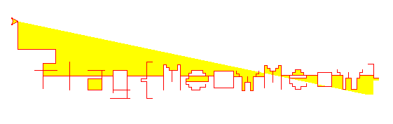
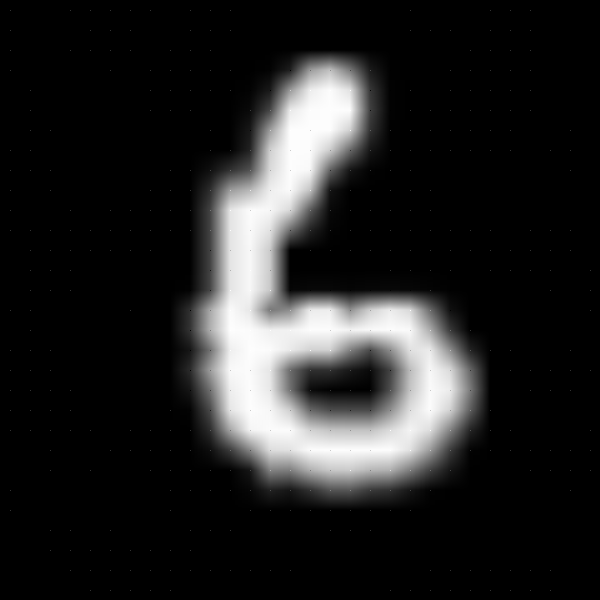

## Hackergame 2018

by <u>社会选手 cvhc</u>

本来是校内选手。但由于贵社 GitHub 仓库权限设置不慎，我能看到包含题目答案的仓库…… 为了避免干扰统计，只能伪装成社会选手参赛了。

### 猫咪遥控器 catremote

我用 Python 的 turtle 库画的，代码见 `catremote/catremote.py`。



挺难认的……

###  猫咪电路 red_stone

很久没玩 Minecraft 了，也从没研究过红石电路。主要是我玩 Minecraft 会强烈地 3D 眩晕……

做法就是从输出往输入方向推，判断哪里的红石应该激活/不激活。其实也不用搞清楚每个元件什么含义，我遇到复杂的不认识的组件，就直接插火把或者敲方块改变输入测试。

### 家里有矿 mining_pool_of_Z

#### 暴力破解（MD5）

这题题面有误导啊…… 我一开始一直以为暴力搜索都能解决的，所以就不断在优化穷举程序。一开始是 Python 版本，又改成 CPU 版本，最后写了个 OpenCL 的 GPU 版本。最终的 GPU 暴力搜索的程序在 `mining_pool_of_Z/gpu-brute/` 下。

MD5 是能暴力搜索的。虽然有不少已知的 MD5 碰撞，但这题要求 MD5 的 suffix 有16位长，预先算好碰撞再撞 suffix 不太现实。直接上 `gpu-brute`，我用 GeForce 1060 只要不到两分钟就能达到 102 的 difficulty，所以拿到 suffix 当场爆破就行了。

SHA1 和 SHA256 都不行。可以用 `gpu-brute` 试试，SHA1 能到 120 多，SHA256 能到 180 多，再往上提升就基本不可能了。

#### 区块链当彩虹表（SHA256）

比特币的原理也是撞 SHA256 Hash，要尽量让 `SHA256(SHA256(Block_Header))` 末尾的 0 比特尽可能多。目前最新的区块的 Hash 末尾有了至少 70 个 0 比特——也就是说随便找两个最新的区块，起码这 70 多位都相同。

参考前面的暴力搜索的数据，Hash 中剩余的位数有 `180/256=70%` 相同的结果应该并不难找到。这样就可以期待达到 `70 + (256-70)*0.7 = 200.2` 的 difficulty，符合要求。

我写了两个抓区块链的 Python 脚本。最开始用 `mining_pool_of_Z/sha256-blockchain/bitcoin-block-parser-online.py` 这个，从 blockexplorer.com 网站抓的。后来发现有点慢，就自己用官方比特币客户端同步区块链，然后用 `mining_pool_of_Z/sha256-blockchain/bitcoin-block-parser.py` 解析区块链数据。

这两个脚本会把 `SHA256(Block_Header)` 和 `SHA256(SHA256(Block_Header))` 提出来存到 `blockchain.db` 文件，然后运行 `find-collision.cpp` 程序搜索碰撞位数最多的两个 Hash 即可。最后采用的结果是（注意：平时用来标识区块的 Hash 的字节顺序和我输出的相反，我也不知道为什么）：

```
New record! DIFF = 199
 MSG1: c141eafba3bee4029ab2e2c0cd079336929ac92ca5f11c227e50382a870d2d61
HASH1: a7830f17a7db06af52973b608921e122300e1f399d401b000000000000000000
 MSG2: eca0be7efb8256e77d99700cfd29782f447b3564f3926a6b6b9151e036356a61
HASH2: b69a861ec5464ead54b75eb88f20f525348e5c1d8de199a60000000000000000
```

提交任务时，不断向服务器刷新 suffix，直到和我预先算好的消息后缀（0x61=a）相同，就可以提交任务了。

#### 最简单的是 SHA1

SHA1 其实最简单了，利用 [SHAttered](https://shattered.io/) 攻击得到的一对碰撞即可。关键在于，在那两个碰撞的文件后面添加相同的数据，得到的两个新文件仍是碰撞的（我一开始不知道…… 最后查资料才明白，所以最后才做的 SHA1）。

### C 语言作业 calculator

这题认真地手动反编译了[整个 `main` 函数](https://cfp.vim-cn.com/cbfp8?c )，编译后的指令和可执行文件几乎一毛一样。然而一点用都没。

看了 `objdump -d calc` 的结果，注意到给的可执行文件里面有调一些可疑的函数，比如 `signal`、`execlp` 等。下面看 `__init` 函数部分：

```
 9fa:	48 8d 35 79 ff ff ff 	lea    -0x87(%rip),%rsi        # 97a <__err>
 a01:	bf 04 00 00 00       	mov    $0x4,%edi
 a06:	e8 05 fe ff ff       	callq  810 <signal@plt>
 a0b:	48 8d 35 68 ff ff ff 	lea    -0x98(%rip),%rsi        # 97a <__err>
 a12:	bf 06 00 00 00       	mov    $0x6,%edi
 a17:	e8 f4 fd ff ff       	callq  810 <signal@plt>
 a1c:	48 8d 35 57 ff ff ff 	lea    -0xa9(%rip),%rsi        # 97a <__err>
 a23:	bf 08 00 00 00       	mov    $0x8,%edi
 a28:	e8 e3 fd ff ff       	callq  810 <signal@plt>
 a2d:	48 8d 35 46 ff ff ff 	lea    -0xba(%rip),%rsi        # 97a <__err>
 a34:	bf 0b 00 00 00       	mov    $0xb,%edi
 a39:	e8 d2 fd ff ff       	callq  810 <signal@plt>
```

这里注册的分别是 SIGILL（0x4）、SIGABRT（0x6）、SIGFPE（0x8）和 SIGSEGV（0xB）。然后回调函数是 `__err`，这个函数也很可疑，里面有调用 `execlp`

```
 9e7:	e8 54 fe ff ff       	callq  840 <execlp@plt>
```

可以手动用 `kill` 命令触发一些信号，看看效果（比如 `pkill -ABRT calc `）：

```
This is my simple calculator homework
Examples: 1+1 2-3 4*5 9/5
>>> Program crashed! You can run a program to examine:
```

噎，好像成功了！但是怎么在远程服务器上触发这些信号？SIGSEGV、SIGILL 得指望程序漏洞。SIGABRT 也没查出来怎么在 telnet 环境手动触发。

一开始没想到 SIGFPE，因为我之前只知道整除0会出 SIGFPE，测试过发现已经判断了除0的情况。后来读了 `man 7 signal` 知道了另一种情况：

```
Integer division by zero has  undefined result.  On some architectures it will generate a SIGFPE signal.  (Also dividing the most negative integer by -1 may generate SIGFPE.) 
```

嗯，`INT_MIN / -1`，除法会溢出，也会触发 SIGFPE。

 ### 加密算法和解密算法 encryption_and_decryption

推荐个[带优化的 Brainfuck to C/Java/Python 编译器](https://www.nayuki.io/page/optimizing-brainfuck-compiler )，编译出来循环都优化没了（见 `encryption_and_decryption/out.c`） ！

得益于这个编译器，一下子就看出来了，其实输入到输出就是个线性映射 `y = Ax + B`，解出来矩阵 `A` 和向量 `B`，求 GF(64) 上 `A` 的逆矩阵就行了。代码详见 `encryption_and_decryption/solve.py`。

### 王的特权 permission

提供一个不同于参考答案的 GDB 反编译方法。

按照错误提示添加 `RUST_BACKTRACE=1` 运行后，得到调用栈：

```
$ RUST_BACKTRACE=1 ./b
thread 'main' panicked at 'Permission denied', libcore/option.rs:1010:5
stack backtrace:
......
   8: core::option::expect_failed
             at libcore/option.rs:1010
   9: b::main
......
```

看名字推测，第9层到第8层这里应该比较关键，进入第8层这里应该已经是触发异常了。开 GDB，断点在 `expect_failed` 这儿，跳到上一层调用，然后往前翻汇编。Rust 的反汇编很难看懂，但还是注意到有个名字很友好的函数调用：

```
0x55555555aa28 <_ZN1b4main17h68e9c4d0c5168d89E+120>     callq  0x5555555a1610 <core::str::pattern::StrSearcher::new>
0x55555555aa2d <_ZN1b4main17h68e9c4d0c5168d89E+125>     cmpq   $0x1,0x60(%rsp)
0x55555555aa33 <_ZN1b4main17h68e9c4d0c5168d89E+131>     jne    0x55555555ab7a
```

多半是匹配字符串作为判断是否执行的条件吧。可以在这里断点看看，看寄存器里的地址就很可疑：

```
(gdb) b *0x55555555aa28
(gdb) run
Breakpoint 2, 0x000055555555aa28 in b::main ()
(gdb) x/s $rsi
0x7ffff7821060: "/home/cuihao/temp/hackergame/permission/b"
(gdb) x/s $rcx
0x5555555a5a64: "sudoreadPermission deniedb.rswrite\ndecode"
```

也没必要理解这里在干啥。下面返回后比较的 `0x60(%rsp) ` 应该是返回值，`cmp` 指令会影响程序流程。强行改掉返回值就可以进入另一条流程了：

```
(gdb) nexti
0x000055555555aa2d in b::main ()
(gdb) x/g $rsp+0x60
0x7fffffffe110: 1
(gdb) set {long long}0x7fffffffe110=0
(gdb) c
Continuing.
flag{CA11m30xidiz3r}
[Inferior 1 (process 19463) exited normally]
```

### 对抗深渊 adversarial

对抗样本现在挺火的，正好最近我也在研究。这题用的 FGSM 方法算是最简单的一种，参考代码也给了，我不会 PyTorch 照抄也能搞定。控制像素修改量的话，设置好修改图片时的 epsilon 就行。直接跑出来的对抗样本图大概是这样：

但这题又加了看似很严格的修改像素数（1%）限制。上面的图直接放大提交上去是不行的。这可能是这题最难的地方。

注意到程序里最终还是把大图下采样后识别的，下采样的方法是**最近邻插值法**（Nearest interpolation）。原理大概是这样：`F[x,y]=G[round(x*r1), round(y*r2)]`，其中 `G` 是原图，`F` 是下采样后的图，`r1, r2` 是长宽缩小的比例。其实只需要修改大图中映射到的 30x30 个像素，就能使得缩小后的图是期望的对抗样本图了（注意图中网格分布的小的像素点，就是被修改的位置）：



数据预处理那一步其实没啥意思…… 不过由于我不会 PyTorch，看了半天才看出来。

这题考到最近邻插值法的缺陷，挺让我意外的，因为上个学期正好研究过这个事情。当时我注意到微信图像压缩的部分图像会出现严重的摩尔纹，进一步发现这是最近邻插值法下采样的结果。后来组内师兄实现了一个有趣的东西，可以把一个小图嵌入一张大图里面，原图看不明显，但微信压缩后小图会显示出来。
