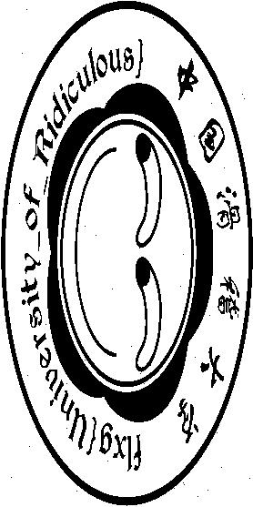

### 秘籍残篇  

#### 滑稽Art  

下载文件之后用Notepad++缩放发现像是有规律的图像即将出现一样，但是Notepad++能缩小的比例不够。最终还是选用PIL画图查看：  

	from PIL import Image
	
	data = open('malbolge.txt', 'rb').read()
	# print len(data)
	# 2^2 * 139 * 277
	width = 277
	height = 4*139
	image = Image.new('RGB', (width+1, height+1), (255, 255, 255))
	for i in xrange(width*height):
	    if(data[i] == ' '):
	        image.putpixel((width-i/height, i%height), (255, 255, 255))
	    else:
	        image.putpixel((width-i/height, i%height), (0, 0, 0))
	image.save("233.jpg")

就有：  

[返回](../)  