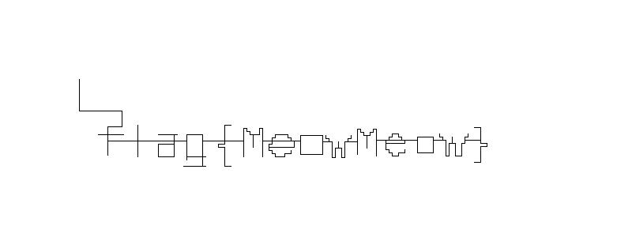

### 猫咪遥控器

看完题目描述之后再看文件里那些UDLR，果然还是要画图：  

	from PIL import Image
	seq = open('seq.txt', 'rb').read()
	
	width = 800
	height = 300
	pos = [100, 100]
	image = Image.new('RGB', (width, height), (255, 255, 255))
	
	for c in seq:
	    image.putpixel((pos[0], pos[1]), (0, 0, 0))
	    if(c == 'D'):
	        pos[1] += 1
	    if(c == 'U'):
	        pos[1] -= 1
	    if(c == 'L'):
	        pos[0] -= 1
	    if(c == 'R'):
	        pos[0] += 1
	    
	image.save("seq.jpg")

画图结果：  

[返回](../)