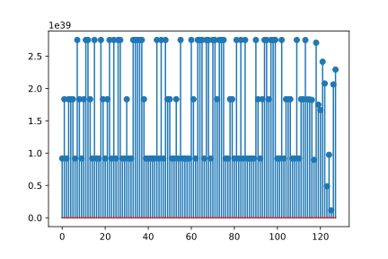

# Hackergame 2018 writeup

by Myon

# 秘籍残篇

上Google搜malbolge reverse engineering出来的第一个结果是 https://www.matthias-ernst.eu/malbolgereverse.html 。这题跟文中的流程几乎一样，判断相等的方法也是一样的。这题密码有9个字符，但实际上先随便取一个密码，然后从结果逆推，改掉最后几位就行了。

做完之后发现是第二问，然后才发现源代码拼的图案里就有flag…

# FLXG 的秘密

挺长的一道题，做了挺久以为是方法不对，但是因为没有过程分，所以刚完了…然后发现好像本来就是这么长。

## 0 伏羲先天六十四卦

在维基上搜到顺序表，然后写个脚本转成base64就好了。我是拿python的base64解码的，所以一眼看到解压结果末尾的第一个flag。

## 1 得到的文件

base64 解码之后file一下，发现是一个1024.tar.gz，但是直接解压的话会提示文件损坏。搜了一下部分解压的方法，这里的答案就很好用： https://stackoverflow.com/a/28363188

解压出来有flag（ELF），passkey.txt（看起来像损坏的ELF）和一个locks文件夹（内含1024个so）。

## 2 flag主程序

IDA打开flag，发现是从passkey.txt里面读了1024个整数，那么看来是原本给的passkey.txt是没用了。读完整数之后会把整数交给对应的locks/lock.so来验证，验证函数是`__int64 __fastcall check(__int64 a1)`，注意到这里读进来的数会用来算flag，所以直接把`verify`函数给patch掉是不可取的。

# 3 locks

IDA打开第一个lock.so.000，查看`check`函数：

```c
__int64 __fastcall check(__int64 a1)
{
  _BYTE *v1; // ST18_8@1

  v1 = &u;
  u += *((_BYTE *)&u + 4) + 1;
  *((_BYTE *)&u + 1) += *((_BYTE *)&u + 4) + 1;
  v1[2] += v1[4] + 1;
  v1[3] = v1[4] + 1 + *((_BYTE *)&u + 3);
  key = a1;
  signal(5, (__sighandler_t)handler);
  raise(5);
  signal(5, (__sighandler_t)1);
  return u != 0xC386BBC4CD613E30LL;
}
```

可以看到`check`里面对全局变量u进行了一些操作，然后设置了`SIGTRAP`的handle，然后发了`SIGTRAP`，最后重置了`SIGTRAP`的handle。然后是`handler`：

```c
void __fastcall handler(__int64 a1)
{
  if ( (_DWORD)a1 == 5 )
  {
    u = 0xC386BBC4CD613E30LL;
    lock(a1);
    unlock();
  }
}
```

这里首先把u设置了一个值，然后调用了`lock()`（其实这个函数没有参数，只是IDA会认为`%rcx`里面的值可能是函数参数）和`unlock()`，最后在`check()`里面会比对`u`的值是否和原来相等。所以接下来是`lock()`和`unlock()`：

```c
unsigned __int64 lock()
{
  __int64 v0; // rdx@1
  unsigned __int8 *v1; // rcx@1
  unsigned __int8 v2; // al@2
  unsigned __int8 v3; // al@2
  unsigned __int64 result; // rax@2

  v0 = 0LL;
  u = 0x1E2FEB89414C343CLL * key
    + u
    - 0x304B683D205D74ACLL
    - 2 * (u & (0x1E2FEB89414C343CLL * key - 0x304B683D205D74ACLL));
  v1 = (unsigned __int8 *)&u;
  do
  {
    v2 = *v1 ^ (4311810305LL * (2149582850LL * *((_BYTE *)&u + v0 + 7) & 0x884422110uLL) >> 32);
    *v1 = v2;
    v3 = *((_BYTE *)&u + v0 + 7) ^ (4311810305LL * (2149582850LL * v2 & 0x884422110uLL) >> 32);
    *((_BYTE *)&u + v0-- + 7) = v3;
    result = 4311810305LL * (2149582850LL * v3 & 0x884422110uLL) >> 32;
    *v1++ ^= result;
  }
  while ( v0 != -4 );
  return result;
}

signed __int64 unlock()
{
  signed __int64 v0; // rsi@1
  __int64 v3; // rcx@1
  signed __int64 result; // rax@1

  v0 = 4 * ((2 * (u & 0x5555555555555555LL) | (u >> 1) & 0x5555555555555555LL) & 0x3333333333333333LL);
  _RAX = 16
       * ((v0 | ((2 * (u & 0x5555555555555555LL) | (u >> 1) & 0x5555555555555555uLL) >> 2) & 0x3333333333333333LL) & 0xF0F0F0F0F0F0F0FLL) | ((v0 | ((2 * (u & 0x5555555555555555LL) | (u >> 1) & 0x5555555555555555uLL) >> 2) & 0x3333333333333333LL) >> 4) & 0xF0F0F0F0F0F0F0FLL;
  __asm { bswap   rax }
  v3 = _RAX + key;
  result = 2 * (key & _RAX);
  u = v3 - result;
  return result;
}
```

打个草稿推一下的话，会发现`lock()`里面那个do...while循环，和`unlock()`里面到`bswap`的部分其实是64bit的比特逆序。比特逆序做两次的话就抵消了。然后`unlock()`最后那一部分，

```c
u = _RAX + key - 2 * (key & _RAX)
  = (_RAX | key) - (key & _RAX)
  = _RAX ^ key
```

只是一个异或而已。`lock()`的开头部分也是一个异或，但是用的是`p1 * key + p2`，`p1`和`p2`就是那俩很长的常数。所以`check()`的本质就是比较`p1 * key + p2`和`key`是否相等，这是个对$2^{32}$的同余方程，因为`p1 - 1`是奇数所以很好解。

然后打开了几个别的lock.so，发现结构是一样的，只是里面的常数`p1`和`p2`有区别。那么，接下来就是开1024遍IDA抄常数了……不过开了不到10个就没有毅力了，得想个办法自动化一下，于是想到了`ctypes`。注意到要是我们把`u`设成0，再调用一下`lock()`，`u`就会变成`p1 * key + p2`了。于是：

```python
import ctypes

for i in range(1024):
    nn = hex(i)[2:].zfill(3)
    lock = ctypes.cdll.LoadLibrary('locks/lock.so.' + nn)
    check = lock.check
    check.argtypes=(ctypes.c_int64,)
    check.restype =ctypes.c_int64
    check(0)             # Set key = 0
    ctypes.c_int64.in_dll(lock,'u').value = 0  # Set u = 0
    lock.lock()          # bitinv(u) = u ^ (p1 * key + p2) = p2
    p2 = revbits(ctypes.c_int64.in_dll(lock,'u').value, 64)
    check(1)             # Set key = 1
    ctypes.c_int64.in_dll(lock,'u').value = 0  # Set u = 0
    lock.lock()          # bitinv(u) = u ^ (p1 * key + p2) = p1 + p2
    p1 = revbits(ctypes.c_int64.in_dll(lock,'u').value, 64) - p2 - 1
    p1 %= 1<<64
    sol = (modinv(p1, 1<<64) * -p2) % (1<<64)
    assert not check(sol)
    print(sol)
```

里面有两个函数，`revbits`和`modinv`是比特逆序和模逆，上网抄一份就好了。

把这个脚本放在WSL（当然linux应该也是可以的）里面跑一下，就能得到passkey.txt了。然后运行flag，发现不报错了，想必是passkey.txt已经正确了，只要等一会就会出结果了。

## 4 漫长的flag

flag扔着跑之后就去睡觉了，结果第二天还没有出结果，回去看题目，发现`这个程序运行起来需要 2000 年甚至更久`……看来还有问题。

```c
  __gmpz_init(&v19, argv, envp);
  __gmpz_init(&v18, argv, v3);
  v4 = fopen("passkey.txt", "r");
  if ( v4 )
  {
    v15 = v4;
    *(_QWORD *)&v17 = 0LL;
    *((_QWORD *)&v17 + 1) = 0LL;
    while ( ~(_QWORD)v17 | ~*((_QWORD *)&v17 + 1) )
    {
      __gmpz_set_ui(&v18, 0LL);
      v6 = 16LL;
      v7 = &v20;
      while ( v6 )
      {
        *(_DWORD *)v7 = 0;
        v7 = (__int64 *)((char *)v7 + 4);
        --v6;
      }
      rewind(v15);
      for ( i = 0; i <= 127; ++i )
      {
        for ( j = 0; j <= 7; ++j )
        {
          v9 = __isoc99_fscanf(v15, "%lu", &v20 + j);
          // 这里原来有个if(verify(...))，因为那些so会发SIGTRAP影响调试，被我patch掉了
          v10 = 2LL * (j / 2);
          v11 = v21[2 * (j / 2)];
          v12 = (v21[2 * (j / 2)] << 32) | ((unsigned __int64)*(&v20 + 2 * (j / 2)) >> 32);
          *(__int64 *)((char *)&v20 + v10 * 8) = ((*(&v20 + 2 * (j / 2)) << 32) | ((unsigned __int64)v21[2 * (j / 2)] >> 32)) ^ *(&v20 + 2 * (j / 2));
          v21[v10] = v12 ^ v11;
          Hash((char *)&v20, 0x40uLL, &v20);
        }
        v22 &= 0x7C00u;
        xor(&v20, (char *)&w + 32 * i);
        __gmpz_set_str(&v19, &v20, 18LL);
        v14 = ((unsigned __int64)v17 >> (127 - (unsigned __int8)i)) | (*((_QWORD *)&v17 + 1) << (64 - (127 - (unsigned __int8)i)));
        if ( (127 - (_BYTE)i) & 0x40 )
          v14 = *((_QWORD *)&v17 + 1) >> (127 - (unsigned __int8)i);
        if ( v14 & 1 )
          __gmpz_add(&v18, &v18, &v19);
      }
      LOWORD(v22) = 56;
      xor(&v20, (char *)&w + 32 * i);
      __gmpz_set_str(&v19, &v20, 18LL);
      if ( !__gmpz_cmp(&v18, &v19) )
      {
        __printf_chk(1LL, "Oh, sure! Flag is flxg{%016lx%016lx}.\n", *((_QWORD *)&v17 + 1), v17);
        goto LABEL_25;
      }
      ++v17;
    }
```

这里有3层循环，最外层是`__uint128 v17`取遍所有可能值，内两层是按`128 x 8`依次读passkey.txt里面的1024个数。对于最外层循环的每次执行，会在中间一层算出一个数，然后根据`v17`的某一bit位决定是否加进一个累加变量，最后把累加变量和预设值比较，flag是`v17`。所以这是一个寻找特定元素和的子集的题目。

Hash函数过于复杂了，并不想去分析，于是直接在`__gmpz_set_str`上面下断点，然后把字符串`v18`给dump出来，然后手工做一下18进制转换。这里吐槽一下gdb好像没有原生的把一些指令反复执行的方法，结果弄了个文件，把`c`和`x/s $rsi`复制粘贴了128遍，然后用gdb去source它。目标常数的字符串`v20`手工dump出来就行。

当然这里走了个弯路，看到右移都是`127-i`的时候，第一反应是`i<64`时结果恒为零，所以误以为只用到了后64个数据。然后想着一共64个数，写个中途相遇和剪枝应该就能暴搜出来。结果…并没有搜到解。重读反汇编发现那里的移位是`sar`，而`sar`是自带bit mask的，只取第二个操作数的后5位。所以这里就是个128元集合，寻找特定元素和的子集，然后子集就是flag的问题。

# 5 找子集



拿pyplot画了一下passkey里面的数，发现特征挺明显的，基本上是某个大数（或它的2倍/3倍）加上一个小量。所以小量可能是重要信息。经过一番对模数的寻找，发现如果把模数取`(v1[1]//2+25)`的话：（下面代码里，`v1`是passkey数组，`v2`是目标的和）

```python
q=[(-x)%(v1[1]//2+25) for x in v1]
print([q[x] > sum(q[:x]) for x in range(1,128)])
# [True, True, True, True, True, True, True, True, True, True, True, True, True, True, True, True, True, True, True, True, True, True, True, True, True, True, True, True, True, True, True, True, True, True, True, True, True, True, True, True, True, True, True, True, True, True, True, True, True, True, True, True, True, True, True, True, True, True, True, True, True, True, True, True, True, True, True, True, True, True, True, True, True, True, True, True, True, True, True, True, True, True, True, True, True, True, True, True, True, True, True, True, True, True, True, True, True, True, True, True, True, True, True, True, True, True, True, True, True, True, True, True, True, True, True, True, True, True, True, True, True, True, False, False, False, False, False]
```

q是余数列表，会发现除了最后5个之外，前面的每个数都大于其之前数的和，意味着只需要逆序考虑，贪心地去取元素就好了。最后5个数的话，暴举一下也很快。

```python
def fx(x):
    ss = []
    for i in range(122,-1,-1):
        if x >= q[i]:
            x -= q[i]
            ss.append(i)
    assert x == 0
    return ss[::-1]

def findset(s):
    for pre_subtract in powerset(v1[123:]):
        ss = s - sum(pre_subtract)
        try:
            print(fx((-ss)%(v1[1]//2+25)), [v1.index(x) for x in pre_subtract])
        except AssertionError:
            pass

findset(v2)
# [0, 1, 2, 4, 7, 10, 11, 14, 15, 17, 18, 19, 20, 21, 24, 25, 26, 30, 34, 39, 40, 43, 47, 50, 52, 53, 54, 56, 58, 61, 62, 63, 64, 65, 66, 69, 72, 79, 80, 82, 83, 86, 87, 88, 89, 91, 92, 95, 96, 98, 101, 102, 106, 107, 113, 115, 117, 118, 121] [124, 125, 126]
```

然后把这个结果转成16进制就是最后的flag了。

# C语言作业

这个程序总是5秒退出，不太方便。开gdb调试发现它收到了`SIGALRM`然后就退出了。开IDA找相关代码，发现

```c
unsigned int _init()
{
  signal(4, (__sighandler_t)_err);
  signal(6, (__sighandler_t)_err);
  signal(8, (__sighandler_t)_err);
  signal(11, (__sighandler_t)_err);
  signal(14, (__sighandler_t)&exit);
  return alarm(5u);
}
```

先把最下面那个alarm给patch掉，然后发现`_err`里面可以`execlp`一个程序。所以先考虑怎么制造上述信号之一。不难发现`SIGFPE`可以用`-2147483648/-1`产生，然后枚举一下常见命令，发现`ls`和`vim`是可用的，所以运行`vim`之后，打开flag文件就好了。另外这里`cat`是不好用的，因为这题里`execlp`命令并没有给启动的程序附加参数。

# 加密算法和解密算法

这题对写过brainfuck的人很友好的。程序内的单层循环而且只有第一位是减号，循环内右移左移数目一样多，是个典型的乘法。用sympy（或者任何能做符号运算的东西）写一个解释器，把输入都设成符号，再特殊处理一下这里的乘法，就能发现它是一个线性方程组。然后抄一份矩阵模逆的代码就能解出答案了。

# 王的特权

这题可能我做的跟预期不太一样，因为虽然题目说预期解法与网络无关，但是我似乎只用到了网络知识……

IDA打开b，点进`b::main()`：

```c
  // ...
  if ( !*(_QWORD *)(v75 + 16) )
    goto LABEL_103;
LABEL_53:
  v29 = **(_BYTE **)v2;
  std::net::each_addr::hf2723230272d1356(&v61, 0x1D2078BAD143LL);
  if ( (_DWORD)v61 == 1 )
  {
    *(__int128 *)((char *)&v58 + 8) = *(__int128 *)((char *)&v61 + 8);
    LODWORD(v58) = 1;
    v61 = *(__int128 *)((char *)&v61 + 8);
    core::result::unwrap_failed::h3cf01bd3916f3c32("called `Result::unwrap()` on an `Err` value", 43LL, &v61);
  }
  v57 = DWORD1(v61);
  LOBYTE(v71) = v29;
  _$LT$std..net..tcp..TcpStream$u20$as$u20$std..io..Write$GT$::write::ha36f9de663ef4927((__int64)&v61, &v57, &v71, 1uLL);
  if ( (_QWORD)v61 == 1LL )
  {
    _mm_store_si128((__m128i *)&v58, _mm_loadu_si128((const __m128i *)((char *)&v61 + 8)));
    core::result::unwrap_failed::h3cf01bd3916f3c32("write\ndecode", 5LL, &v58);
  }
  // ...
```

前面有些运算和`panic_bounds_check`……但我不懂Rust就没管它们了。

这里有个名字带TCP的调用很瞩目。点进去发现是往`fd v57`的位置发送了一个字节。`v57`是上面的`v61`，而`v61`有个`net::each_addr`的调用，后面跟着一个6字节的参数。想必这个参数就是IPv4地址+端口号了。搜一下几个可能的组合出来的IPv4的运营商，意外发现`67.209.186.120`在去年的这个比赛里面用过，想必就是它了。0x201d端口没有开，所以应该就是0x1d20端口了。发送的东西只有一个字节，直接写个脚本往这个位置试256次，看看能收到些啥。然后发现其实第一次就返回了flag……

# 她的礼物

先把那个5秒退出的SIGALRM handle给patch掉，再把sleep和唱歌的printf和system也patch掉，剩下的输入要求的第10行，就能得到结果了。

# 困惑的flxg小程序

IDA打开程序，发现程序最后有俩字符串，分别是flag正确和flag错误（gbk编码）。用IDA查data xref，发现是在`sub_140004980`里面有用到过。这个函数会把一个字符串进行一些操作，包括`strrev`和一个异或操作，然后和内置的另一个常值字符串进行比较。（因为我没搞清楚怎么调用这个函数，所以直接）用x64dbg改RIP寄存器，然后手工处理一下栈上的内存分配，然后往内存里写一个字符串之后单步调试，发现其实是第i个字符和i做异或。那么把目标字符串逆处理一下，就能得到期望的输入字符串了。

# CWK的试炼

这个绿色通道的最低有效位上嵌着一些信息，右下角是地址，可以socket连上去（其实提示出来之前我也是以为是http，然后一脸懵逼）。中间的框出来的区域明显有些行有8像素一周期的图案，所以把中间那部分以行先的顺序取出来，然后8个bit一字节组合起来，得到一个base64编码后的ELF文件。运行之后有Register和Start Trial两个选项（以及还有个5秒退出的SIGALRM，patch掉就好）。Register会根据输入的用户名算一个token出来，可以在Start Trial里面用，但是会提示not powerful enough。IDA打开之后，发现Register是AES加密了一些东西，而Trial是解密了一些东西。加密密钥是随机的，所以爆破不太现实了。

然后发现Trial里面读字符串是手工写的getchar……很明显是Buffer Overflow Exploit了，读入的东西可以一直往后覆盖，包括Key和IV。最后会对明文有三处判断：判断某两个字节是0xaa，以及有一处字符串是root。直接选好Key和IV，然后把需要的明文加密一下，从输入塞进去就好了，需要拿调试器确定一下内存分布。

# Z 同学的 RSA

这里只用注意到，(p\*q)^(p+q)和(p\*q)^(p-q)，如果p，q的二进制末n位确定了的话，那么这两个数的末n位也确定了。所以逐位尝试p，q的末n位就好了。

```python
st = ...; stt = ...
q=[(1,1)]
for i in range(1, 2000):
    nq = []
    for ai,bi in q+[((1<<i)+x,y) for x,y in q] + [(x,(1<<i)+y) for x,y in q] + [((1<<i)+x,(1<<i)+y) for x,y in q]:
        if ((ai*bi)^(ai+bi)^st)&(2<<i-1)==0 and ((ai*bi)^(ai-bi)^stt)&(2<<i-1)==0 and ai*bi < st*2:
            if (ai*bi)^(ai+bi)==st and (ai*bi)^(ai-bi)==stt:
                print('!!!!!!!!!!!!!!!!!!!!!!!!!!!!!!!!!!!!!!!!!')
                print(ai)
                print(bi)
                nq=[]
                break
            nq.append((ai,bi))
    q=nq
    if not q:
        break
    print(i,len(q))
```

# 数理基础扎实的发烧友

IDA打开程序，发现是把音频（44100采样率单声道）内嵌在了bmp的数据数组的最低有效位上了。音频先上采样0x40倍，然后过了一个对误差积分的编码器（也可以叫PWM），所以只用把每0x40个采样做一下平均就好了。音频是DTMF编码的，（见识少的）我拿MatLab画了个STFT的频谱图手抄出来了。

# 一些宇宙真理

这个……直接拿github看一下fork之后删掉的函数，补回去就好了……用到的几个数组可以直接从下面复制。


* 本次ctf所使用的所有草稿纸已上传，但是没整理挺乱的…[https://motoori.kosuzu.moe/f/cd7f7dd6/ustctf.zip](https://motoori.kosuzu.moe/f/cd7f7dd6/ustctf.zip)