在某 Telegram 群看见了这个来自 USTC 的 CTF 比赛，就玩了一下。

这是我第一次打 CTF（虽然这个和大佬们的 CTF 并不一样），啥经验都没有。也发现自己基础很差，真正感受到了知识储备的重要性，我的知识储备对我解题速度的降低起了很大作用呢。

不过这个还是很好玩的！感谢 USTC 的大佬们！

这里列出的题解都是我在实际答题过程中打通一个写一个这样写下来的，所以还有一些我没做过的题目请移步官方的 writeup。

----------

## 0x01 签到题

只要修改 maxlength 然后提交就好啦。

## 0x02 猫咪问答

真·搜索就行了

## 0x03 游园会的集章卡片

我真的是拼出来的。

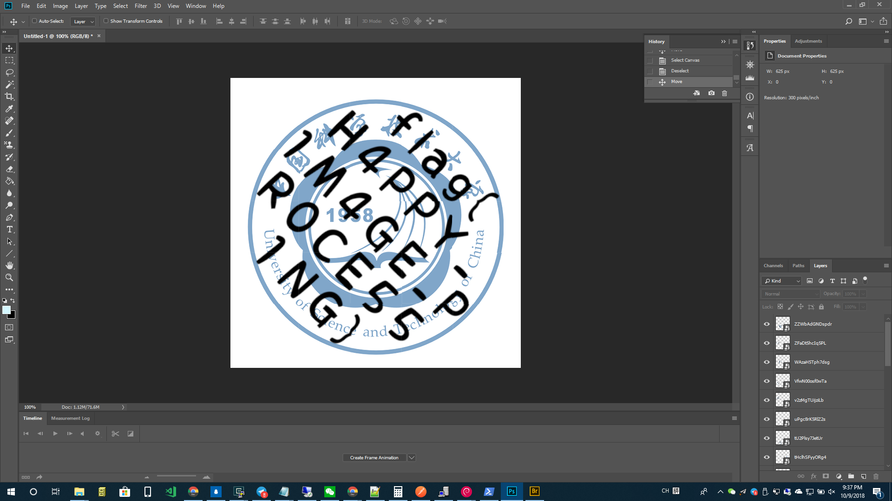

## 0x04 Word 文档

提到了 Office 07 引入的船新格式。这个格式是以 zip 包的形式储存数据。解压可见 flag.txt，然后去掉所有换行就拿到了 flag。

## 0x05 黑曜石浏览器

在页面上找了半天没找到相关的资料。后来利用搜索引擎找到了 `https://heicore.com` ，可以在页面中找到一个判断黑曜石浏览器的 UA，用它就对了。

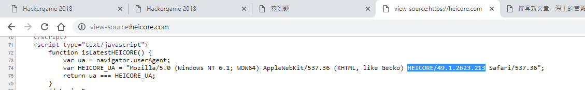

## [0x06, 0x07 我是谁.*](./who_am_i.md)

## [0x08 猫咪克星](./python_simulator.md)

## 0x09 回到过去

就是把下载下来的 `input_sequence` 在 ed 里面敲了一遍…… （大力出奇迹）

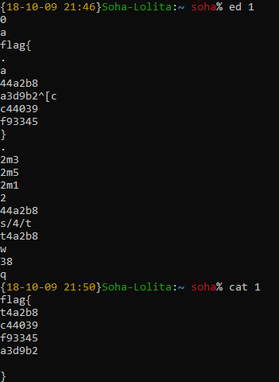

## 0x0a 猫咪电路

就是一个逻辑电路分析。只要最左边输出1就好了。

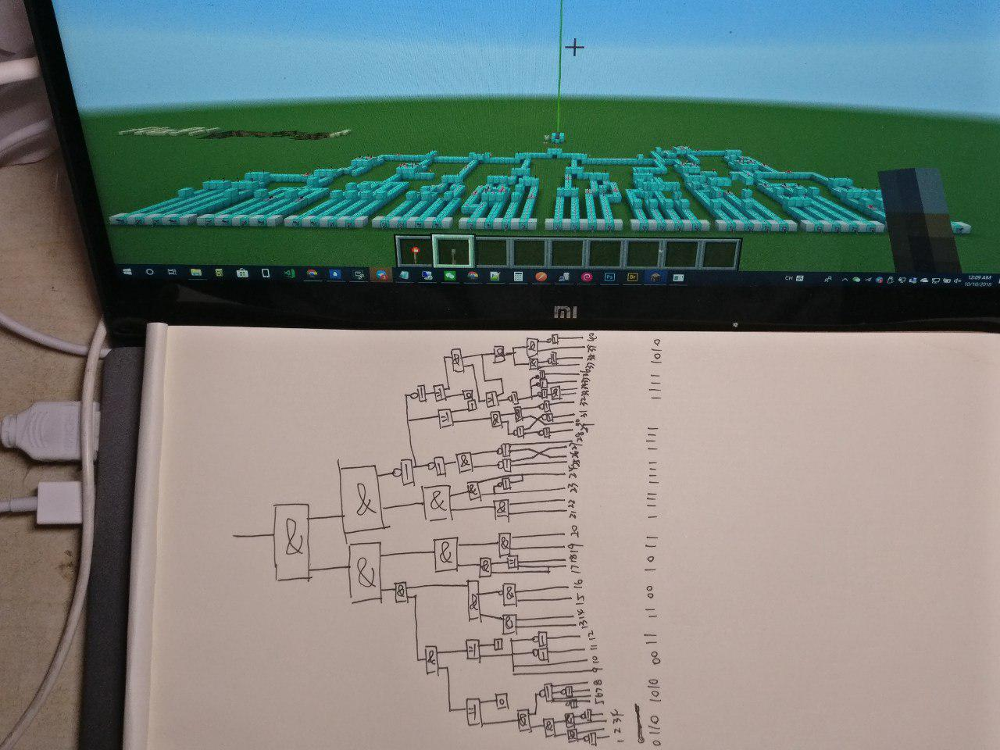

## 0x0b 猫咪和键盘

这是一个将程序源码纵向切割后打乱形成的文件。我也写了个程序来帮我恢复原状。

```python
with open("typed_printf.cpp","r") as f:
	lines=f.readlines()
	for line in lines:
		seg1=line[0:1]
		seg2=line[1:7]
		seg3=line[8:20]
		seg4=line[20:22]
		seg5=line[22:32]
		seg6=line[32:39]
		seg7=line[39:-1]
		print((seg1+seg6+seg2+seg4+seg3+seg5+seg7).strip())
```

恢复原样后按照注释里的指令编译并没有通过。后来查了一下是因为我的 g++ 是 6.3.0，而如果想要成功编译则需要 7+ 的 g++。懒得去改 apt 源，于是我打开了洛谷的在线IDE。

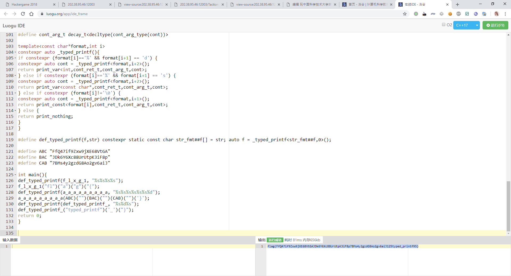

又拿到一个flag。

## 0x0c 她的诗

这个 uuencode 编码的诗，在 Python 解出来的就是正常的诗。这里面肯定有什么玄机，我就把整个诗再给逐行转回去了，发现二次转换并没有还原成最初的文本。那么这里面肯定有什么奇奇怪怪的套路了。后来找来找去，发现每一行的第一个字符被 -1 了。所以原本放在行尾的 flag 被“隐藏”起来了。把它给倒腾回去，然后就发现 flag 都藏在行尾。

*后来了解到第一个字符是标示长度的，所以用 -1 可以隐藏最后一个字符。*

## 0x0d 猫咪遥控器

下载 seq.txt 之后是一堆由U/D/L/R组成的字符串，四个字符分别代表上下左右。把它画出来就好了。

我选择的是将它转成了一个 LOGO 程序然后画出来了。

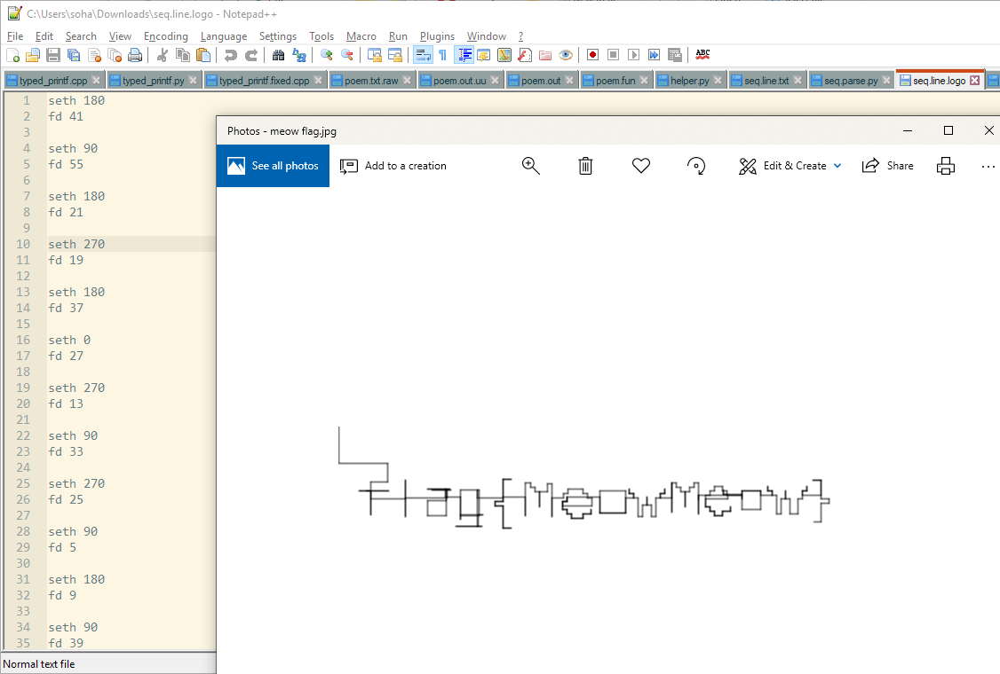

## [0x0e 她的礼物](./her_gift.md)

## 0x0f 秘籍残篇.滑稽Art

打开 malbolge.txt 后首先感觉这个空格有点儿小优雅。于是我不断缩小……

flag get!

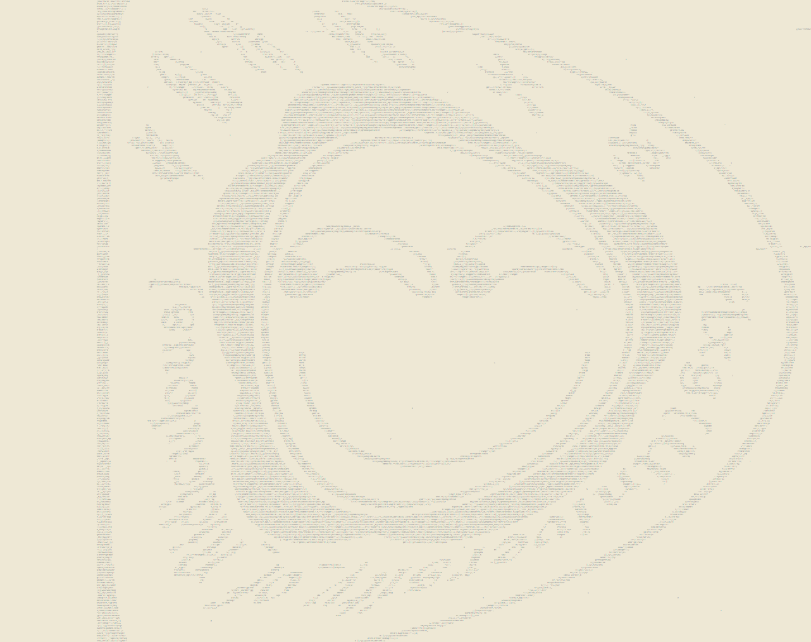

## 0x10 猫咪银行

这居然是这么后面解出来的。

当时看到 PHP 还以为是弱类型坑啊什么的研究了半天，今天上课老师讲了溢出我才意识到还有这一招。

一个大数字就让取出时间变成了公元前。

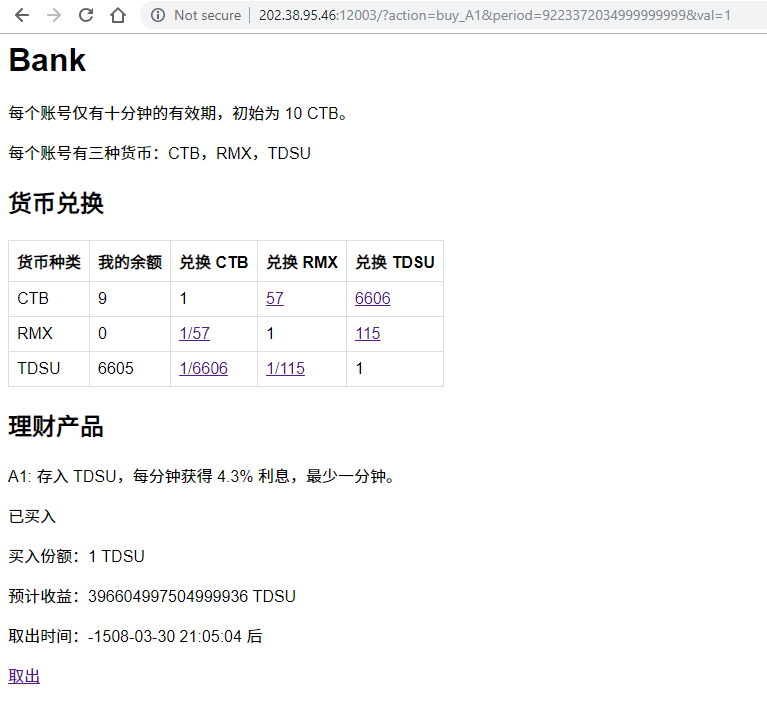

然后直接取出买 flag 就行啦！要是现实当中也有这么多钱就好了。

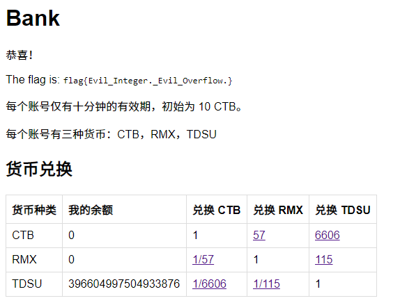

## [0x11 数理基础扎实的发烧友](./audiophile.md)

## [0x12 加密算法和解密算法](./encryption_and_decryption.md)

## 0x13 王的特权

从题面我还真没看出啥。直接打开 IDA。

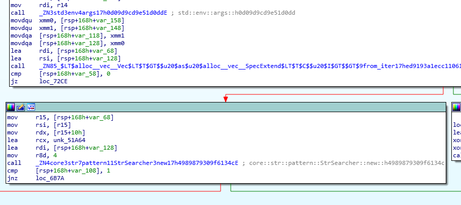

一眼看到有个 StrSearcher，上面参数是 `unk_51A64`。

```
.rodata:0000000000051A64 unk_51A64       db  73h ; s             ; DATA XREF: b::main::h68e9c4d0c5168d89+66↑o
.rodata:0000000000051A65                 db  75h ; u
.rodata:0000000000051A66                 db  64h ; d
.rodata:0000000000051A67                 db  6Fh ; o
```

找“sudo”字符串？当时就想到了重命名。

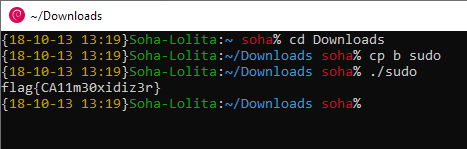

还以为是啥高端玩法，所以一直放着没做。没想到其实这么简单。这道题我是第十个过的，为什么没人过大概也是因为没人觉得这道题目会这么简单？

## [0x14 "C 语言作业"](./calculator.md)

## [0x15 "FLXG 的秘密".来自未来的漂流瓶](./secret_of_flxg.md)

## [0x16 "困惑的 flxg 小程序"](./confused_flxg.md)

----------

这是我从博客中提取出来的部分，删除了一些和题解无关的内容。以及为了减少页面长度和图片加载数量，我将一部分题解新开了个 md。

原文链接  [https://soha.moe/post/ustc-ctf-2018-writeup.html](https://soha.moe/post/ustc-ctf-2018-writeup.html)
