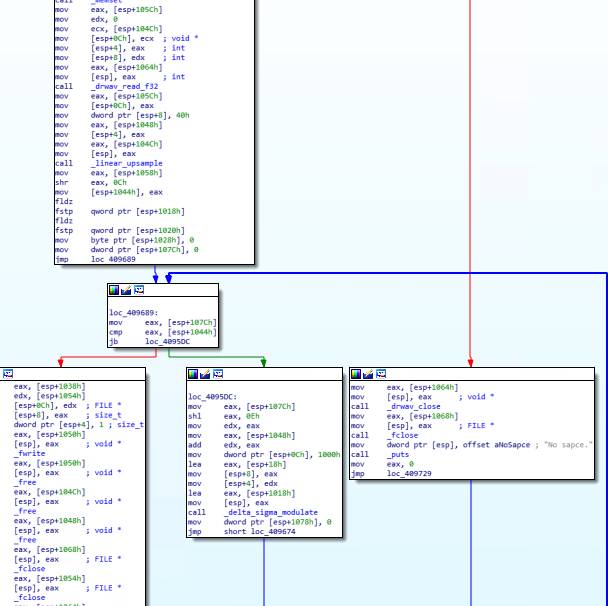
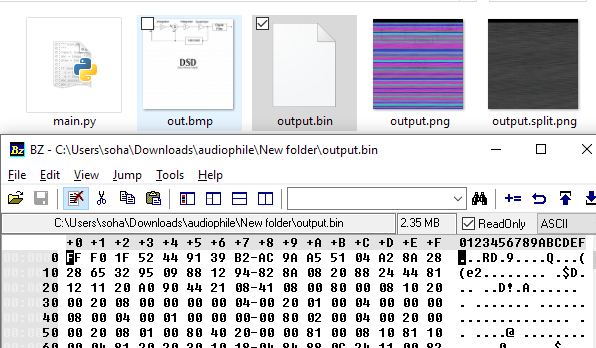
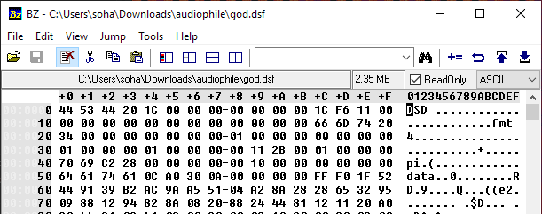
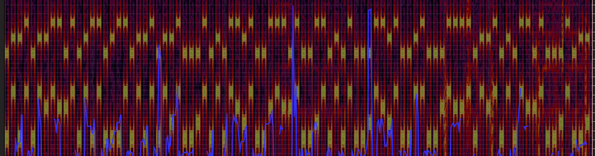

[返回](./README.md)

## 0x11 数理基础扎实的发烧友

拿到压缩包打开发现是张图片和一个隐写程序。bmp图片上大大的DSD，一看就是图片给藏了一个音频文件了。又用 Ps 拉了一下曲线，很明显有数据藏着嘛。


我又反编译了一下 stegan.exe 看了两眼也大概了解了隐写过程。我比较菜，并不知道到 bmp 图片上那个就是 Delta-Sigma Modulate，这是后来才发现的。



那么就从这里入手对图片进行处理，剥离出数据部分然后就得到了 DSD 的二进制数据。



网上搜了一份比较常用的 DSD 音频格式 DSF 的文档，给这些二进制流数据加上文件头使之成为一个成熟的音频。



然后用 ffmpeg 给他转换回 wav 格式的文件。怎么从音频文件中解出数据是个关键。我在这里卡了俩小时。因为最初的没有把采样频率转到 44.1kHz 的时候，在 70kHz 的频谱上有些空格有音频有些空格是空的，所以我最初以为是一串二进制什么的然后通过 ASCII 拿到 flag。然后就这么闷头撞了一个多小时的墙。

后来转了采样频率之后才发现 600-1.5kHz 这里别有洞天啊！不得不说先入为主思想的确不是个好东西。它让我在“猫咪银行”卡了好久，现在又让我在这里卡了半个小时。为什么这么说呢？因为之前我以为是二进制串，我脑子没转过来，继续尝试在 0.6-1.5kHz 种找出二进制串，找了半天规律。听着听着，发现这个音频里的声音怎么这么耳熟呢？每一块怎么就这么恰巧是两个音呢？我一拍大腿，妈呀，这是 DTMF *\([Wikipedia](https://en.wikipedia.org/wiki/Dual-tone_multi-frequency_signaling)\)* 啊！然后就只要根据每一块的音翻译出来就好了。



根据 DTMF 信号翻译出来的是这个东西。

```
102#108#97#103#123#102#105#114#101#95#119#97#116#101#114#95#110#117#99#108#101#97#114#125
```

刚翻译到第四个 `#` 的时候，我就觉得这是 ASCII 的十进制表示。也的确是这样，按 `#` 分割然后用 ASCII 翻译出来了这个玩意儿：

```
flag{fire_water_nuclear}
```

火电、水电、核电，给你不一样的 Hi-Fi 体验。
