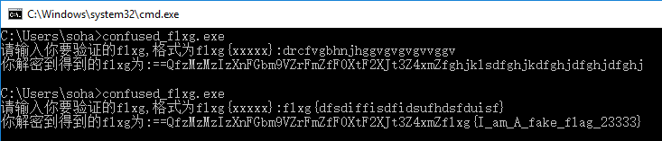
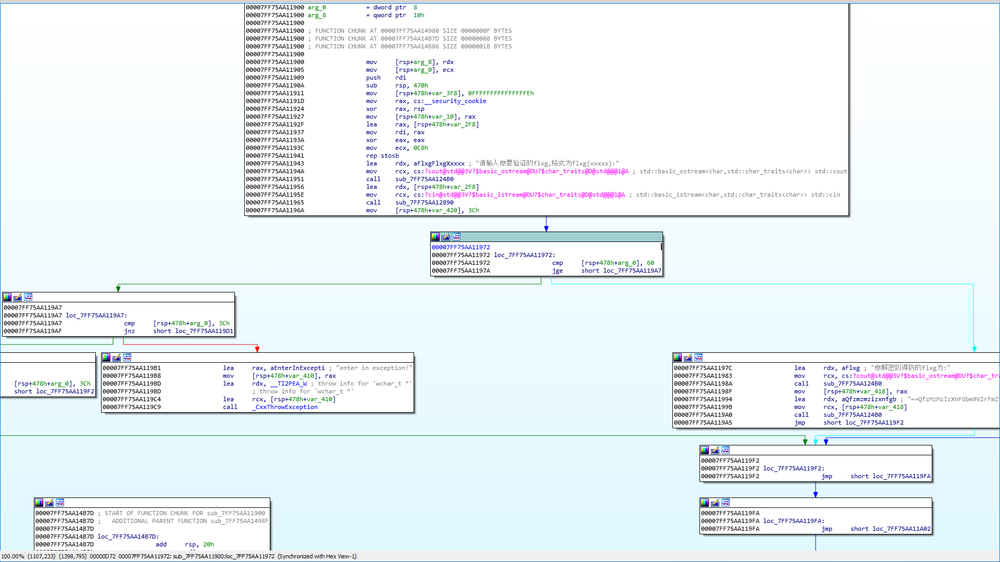
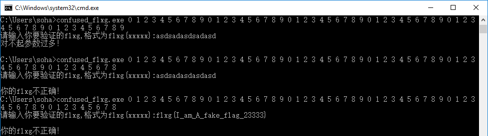
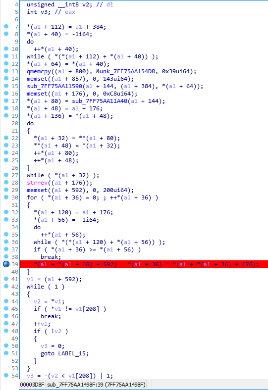
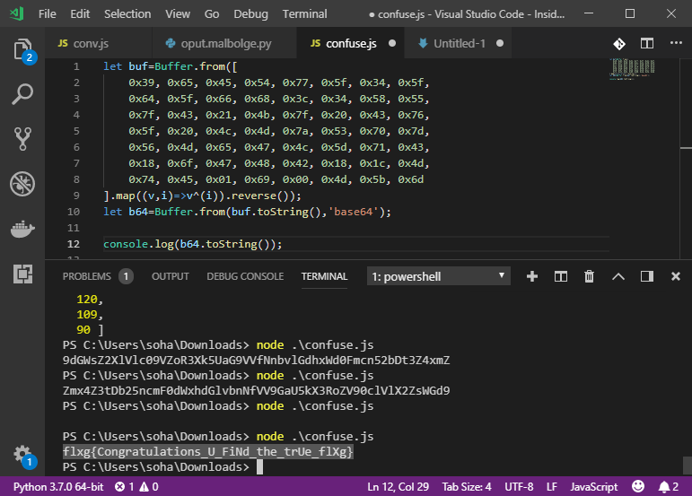
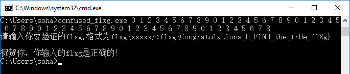

[返回](./README.md)

## 0x16 "困惑的 flxg 小程序"

打开程序不管输什么看起来都没做过任何事情的样子。

直接开 IDA 上反编译！

通过查找 flxg 找到了这里，似乎在参数格式刚好等于 60 个的时候会触发一个 Exception……难道是这里？试一下！

的确！就是这里！找到这部分代码，然后让 IDA 帮我们生成伪代码。

可以看到这里对用户输入转为 base64 后再进行反转了以后做了一波异或，再和系统里面存储的一个字符串进行比对。因此用 `s[i] = i^s[i]` 把 `unk_7FF75AA154D8` 这里存储的长度为 56 的字符串转回 base64。就可以得到 flag 啦！

验证一下。

开心！
