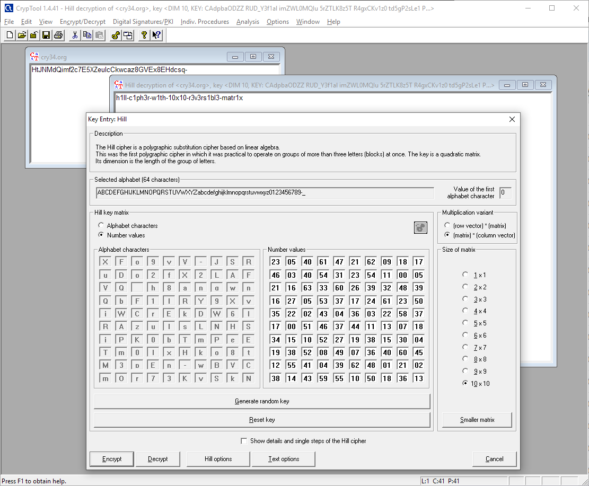

[返回](./README.md)

## [0x12 加密算法和解密算法](./encryption_and_decryption.md)

解压后阅读了 html 文件中的内容，大概意思是，加密算法的核心是用 BrainFuck 写的。加密过程是，先把字符串按每个字符换成其在 base64 中的顺序，然后丢给 BrainFuck 作处理后再丢回来，再重新通过 base64 折成字符串。

我读完 BrainFuck 之后首先先将加密程序用 js 改写了一次，方便我愚笨的脑子理解。

```javascript
let stringMap='ABCDEFGHIJKLMNOPQRSTUVWXYZabcdefghijklmnopqrstuvwxyz0123456789-_';
let magicThings=[
	[ 23, 46, 21, 16, 35, 17, 34, 19, 12, 38 ],
	[ 05, 03, 16, 27, 22, 00, 15, 38, 55, 14 ],
	[ 40, 40, 63, 05, 02, 51, 10, 52, 41, 43 ],
	[ 61, 54, 33, 53, 43, 46, 52, 08, 04, 59 ],
	[ 47, 31, 60, 37, 04, 37, 27, 49, 39, 55 ],
	[ 21, 23, 26, 17, 36, 44, 19, 07, 62, 10 ],
	[ 62, 54, 39, 24, 03, 11, 38, 36, 48, 50 ],
	[ 09, 11, 32, 61, 22, 13, 15, 40, 01, 18 ],
	[ 18, 00, 48, 23, 58, 07, 30, 60, 21, 36 ],
	[ 17, 05, 39, 50, 37, 18, 04, 45, 02, 13 ]
];
let finalAddition=[ 2, 6, 8, 8, 3, 5, 5, 7, 4, 9 ];
let str2num=str40=>str40.match(/.{1,10}/g).map(chunk=>chunk.split('').map(c=>stringMap.indexOf(c)));
let num2str=arr_4=>arr_4.map(a=>a.map(v=>stringMap[v]).join('')).join('');

let encode=function (data){ //data=[16, 20, 8, 2, 10, 63, 1, 17, 14, 22]
	let encoded=[0,0,0,0,0,0,0,0,0,0];
	for(let i=0;i<10;i++){
		for(let j=0;j<10;j++){
			encoded[j]+=data[i]*magicThings[i][j];
		}
	}
	return encoded.map((v,i)=>(v+finalAddition[i])%64);
};

console.log(num2str(str2num("QUICK_BROWN_FOXES_JUMP_OVER_THE_LAZY_DOG").map(v=>encode(v))));
```

因为我几乎没有任何密码学知识，我写出这段 js 后并不知道这是个啥算法。我只根据这个分析出来，解这个需要线代知识。刚上大学，之前也没学过相关知识，于是我在网上查有关矩阵知识的时候发现了 Hill cipher (希尔密码) 这个玩意儿。一看定义，这不就是这个加密算法的基础！magicThings 里面存储的就是密钥矩阵！可惜我因为没有背景知识，并看不出来这些，还把密钥矩阵叫成了“magicThings”，倘若我有这些基础知识铺垫的话，我在题面提到“将原文分为四段，每段长度为十”的时候应该就能猜出这是希尔密码了。

为了方便我默默拿出 CrypTools，输入密钥矩阵解密。CrypTools 似乎有个 bug，就是不管你选的是 `{row vector} * {matrix}` 还是 `{matrix} * {column vector}`，它使用的都是后者。因此我在输入密钥的时候自己来了个行列转置。

咦？怎么解密出来的东西奇奇怪怪的？原来是我忘了还有个 `finalAddition`。将密文预处理后重新解密，就获得了正确的 flag。


