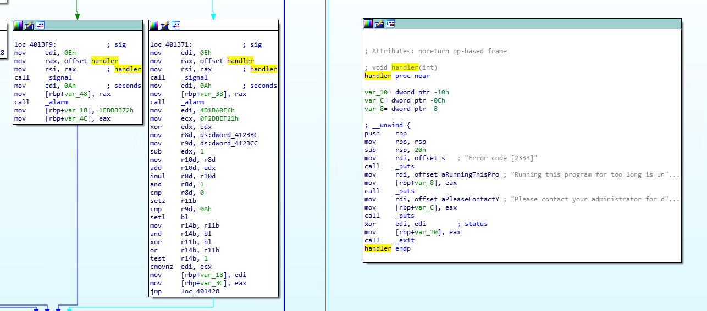
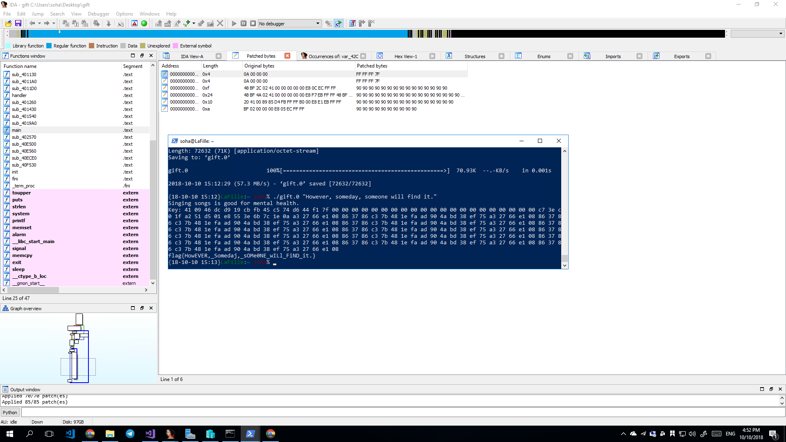

[返回](./README.md)

## 0x0e 她的礼物

首先下载 gift 文件。执行后随便传个参数进去发现会出现这个消息：

```
Error code [2333]
Running this program for too long is unhealthy for your computer.
Please contact your administrator for details.
```

我直接反编译找到了相关的内容。



直接对程序进行了一波魔改，删掉了 too long 那个 alarm，以及干掉了没用的 printf。然后坐等 233333 次程序执行完成拿到 flag。


