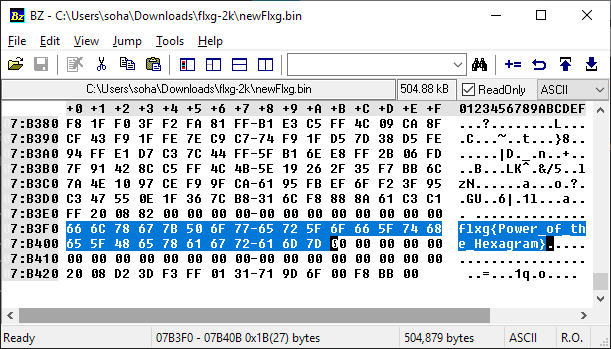

[返回](./README.md)

## 0x15 ["FLXG 的秘密".来自未来的漂流瓶](./secret_of_flxg.md)

文中说了“他们再以四千年前的伏羲先天六十四卦将程序编码”，看到 64 就想到了 base64。所以**按照 Wikipedia 里面从左到右的顺序** *(这里我还专门问了一下我爹相关知识)*，依次替换成 base64 的字符。我使用了下面的 js 来帮我：

```javascript
let fs=require('fs');
let xianTian64Gua=[
	"坤","剥","比","观","豫","晋","萃","否",
	"谦","艮","蹇","渐","小过","旅","咸","遁",
	"师","蒙","坎","涣","解","未济","困","讼",
	"升","蛊","井","巽","恒","鼎","大过","姤",
	"复","颐","屯","益","震","噬嗑","随","无妄",
	"明夷","贲","既济","家人","丰","离","革","同人",
	"临","损","节","中孚","归妹","睽","兑","履",
	"泰","大畜","需","小畜","大壮","大有","夬","乾"
],base64Map='ABCDEFGHIJKLMNOPQRSTUVWXYZabcdefghijklmnopqrstuvwxyz0123456789-_';

let flxg=fs.readFileSync('flxg.txt').toString();
xianTian64Gua.forEach((v,i)=>flxg=flxg.replace(new RegExp(v,'g'),base64Map.charAt(i)));

fs.writeFileSync('newFlxg.bin',Buffer.from(flxg,'base64'));
```

习惯性看了一眼 hex 的头和尾。flag 清晰可见。


