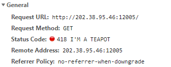
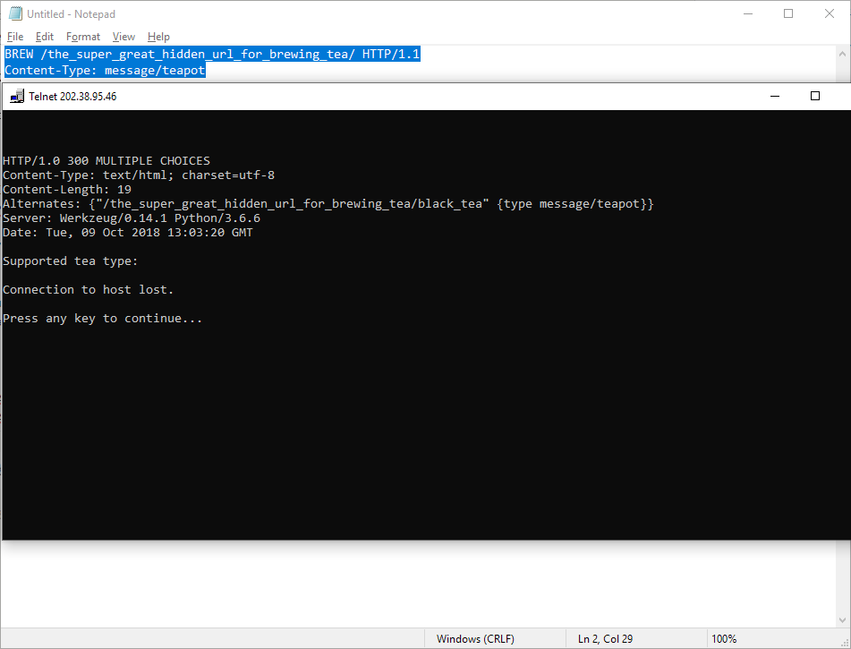
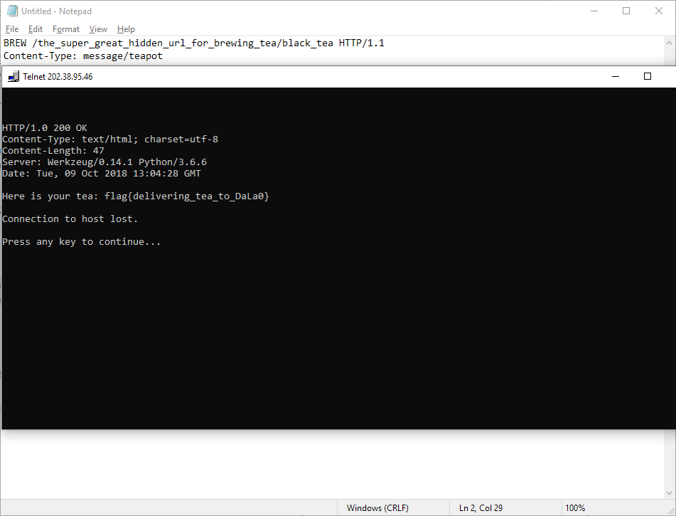

[返回](./README.md)

## 0x06 我是谁.哲学思考

一直开着开发者工具的我一眼就看出了 Network 里面的不对劲。



填入 `teapot` 搞定。

## 0x07 我是谁."Can I help me?"

根据第一根 flag 提供的 url，建议我们使用别的 method 来请求。既然说到 brew tea，说到 teapot，那肯定是 RFC 7168 啦。（ `HTCPCP-TEA` 真好玩！）

读一读 RFC 7168 就可以写出下面这个 payload:

```
BREW /the_super_great_hidden_url_for_brewing_tea/ HTTP/1.1
Content-Type: message/teapot
```



然后接着请求 `Alternates` 里面提供的 url。

```
BREW /the_super_great_hidden_url_for_brewing_tea/black_tea HTTP/1.1
Content-Type: message/teapot
```



嗯……给大佬递茶……
